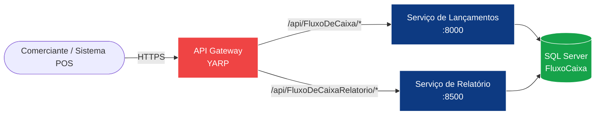
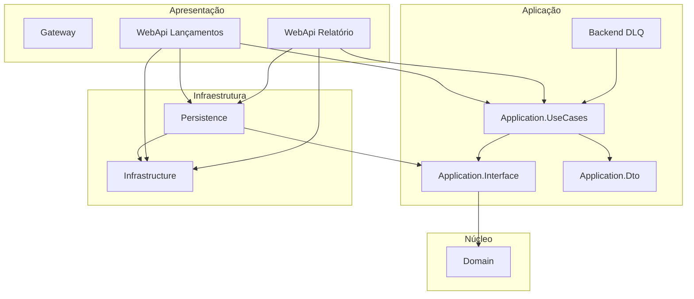

# Fluxo de Caixa | Solução de Arquitetura Corporativa

> Desafio do Arquiteto Corporativo de TI / Implementação de referência em **.NET 8 / C#** com **Clean Architecture + CQRS + Microsserviços + API Gateway**.

[](https://dotnet.microsoft.com/)
[](https://www.microsoft.com/sql-server)
[](https://www.docker.com/)
[](#)

---

## 1. Sumário

- [Fluxo de Caixa | Solução de Arquitetura Corporativa](#fluxo-de-caixa--solução-de-arquitetura-corporativa)
  - [1. Sumário](#1-sumário)
  - [2. Visão Geral](#2-visão-geral)
    - [Problema de negócio](#problema-de-negócio)
    - [Restrição não-funcional crítica](#restrição-não-funcional-crítica)
    - [O que esta solução entrega](#o-que-esta-solução-entrega)
  - [3. Arquitetura em 30 segundos](#3-arquitetura-em-30-segundos)
  - [4. Estrutura da Solução](#4-estrutura-da-solução)
    - [Mapa de dependências entre projetos](#mapa-de-dependências-entre-projetos)
  - [5. Como Executar](#5-como-executar)
    - [5.1 Via Docker (recomendado — sobe tudo: SQL Server + 3 serviços)](#51-via-docker-recomendado--sobe-tudo-sql-server--3-serviços)
    - [5.2 Local (Visual Studio / `dotnet`)](#52-local-visual-studio--dotnet)
  - [6. Endpoints (Contrato da API)](#6-endpoints-contrato-da-api)
    - [POST `/api/FluxoDeCaixa/InsertCredito`](#post-apifluxodecaixainsertcredito)
    - [POST `/api/FluxoDeCaixa/InsertDebito`](#post-apifluxodecaixainsertdebito)
    - [GET `/api/FluxoDeCaixaRelatorio/Relatorio?inicio=2026-01-01&fim=2026-12-31`](#get-apifluxodecaixarelatoriorelatorioinicio2026-01-01fim2026-12-31)
    - [Resposta padrão (envelope)](#resposta-padrão-envelope)
  - [7. Documentação Completa](#7-documentação-completa)
  - [8. Padrões Arquiteturais Aplicados](#8-padrões-arquiteturais-aplicados)
  - [9. Requisitos Não-Funcionais Atendidos](#9-requisitos-não-funcionais-atendidos)
  - [10. Evoluções Futuras](#10-evoluções-futuras)
  - [11. Licença](#11-licença)

---

## 2. Visão Geral

### Problema de negócio
Um comerciante precisa **controlar seu fluxo de caixa diário** (lançamentos de débitos e créditos)
e obter um **relatório consolidado por dia** com o saldo do período.

### Restrição não-funcional crítica
> *"O serviço de controle de lançamento **não deve ficar indisponível** se o sistema de
> consolidado diário cair. Em dias de pico, o serviço de consolidado diário recebe
> **50 req/s**, com no máximo **5% de perda de requisições**."*

Esta restrição é o motor das decisões arquiteturais — em particular o **isolamento físico
em microsserviços independentes** atrás de um **API Gateway**, com bancos
desacoplados logicamente e estratégia de cache no caminho de leitura.

### O que esta solução entrega

| Capacidade | Microsserviço | Tecnologia |
|---|---|---|
| Lançar débito ou crédito | `FluxoDeCaixa.WebApi` | .NET 8 Minimal API |
| Consultar consolidado diário | `FluxoDeCaixaRelatorio.WebApi` | .NET 8 Minimal API |
| Roteamento, agregação e cross-cutting | `FluxoDeCaixa.Gateway` | .NET 8 + YARP |
| Persistência | SQL Server | Dapper |
| Pipeline de aplicação | Compartilhado | MediatR + FluentValidation + AutoMapper |

---

## 3. Arquitetura em 30 segundos



- **Estilo arquitetural**: Microsserviços com **API Gateway (YARP)**.
- **Estilo de código**: **Clean Architecture** com **CQRS** (MediatR) — Domain → Application → Infrastructure → Presentation.
- **Persistência**: **Dapper** (micro-ORM) sobre SQL Server, padrão **Repository + Unit of Work**.
- **Cross-cutting** via Pipeline Behaviours (Validação, Logging, Performance).
- **Resiliência**: serviço de Lançamentos é **autônomo** — falhas no Relatório nunca impactam a captura.

> Ver detalhes em `docs/arquitetura/c4/` (modelo C4 completo, 4 níveis) e `docs/arquitetura/uml/` (UML).

---

## 4. Estrutura da Solução

```
FluxoDeCaixa/
├─ FluxoDeCaixa.sln                      ← Solução .NET (12 projetos)
├─ docker/
│  ├─ Dockerfile.lancamentos             ← Imagem do serviço de Lançamentos
│  ├─ Dockerfile.relatorio               ← Imagem do serviço de Relatório
│  ├─ Dockerfile.gateway                 ← Imagem do API Gateway
│  ├─ docker-compose.yml                 ← Orquestração local completa
│  ├─ .dockerignore
│  └─ sql/init.sql                       ← Bootstrap do banco
├─ docs/
│  ├─ arquitetura/c4/                    ← Modelo C4 (Contexto, Container, Componente, Código)
│  ├─ arquitetura/uml/                   ← Diagramas UML (Classe, Sequência, Componentes, Deploy)
│  ├─ requisitos/                        ← Funcionais e não-funcionais
│  ├─ dominio/                           ← Mapa de domínio e capacidades de negócio
│  ├─ decisoes/                          ← ADRs (Architecture Decision Records)
│  └─ operacao/                          ← Custos, observabilidade, segurança, futuro
└─ src/
   ├─ FluxoDeCaixa.Domain/               ← Entidades + Eventos (núcleo)
   ├─ FluxoDeCaixa.Application.Dto/      ← DTOs entre camadas
   ├─ FluxoDeCaixa.Application.Interface/← Contratos de Repositórios/UoW
   ├─ FluxoDeCaixa.Application.UseCases/ ← CQRS: Commands, Queries, Handlers, Behaviours
   ├─ FluxoDeCaixa.Infrastructure/       ← Helpers de infra (Dapper TypeHandler)
   ├─ FluxoDeCaixa.Persistence/          ← Repositórios + Unit of Work + DapperContext
   ├─ FluxoDeCaixa.WebApi/               ← Microsserviço LANÇAMENTOS  (porta 8000)
   ├─ FluxoDeCaixaRelatorio.WebApi/      ← Microsserviço RELATÓRIO    (porta 8500)
   ├─ FluxoDeCaixaDLQ/                   ← Backend processamento de falhas    
   ├─ FluxoDeCaixa.Tests/                ← Testes unitários
   └─ FluxoDeCaixa.Gateway/              ← API Gateway YARP            (porta 5000)
```

### Mapa de dependências entre projetos



---

## 5. Como Executar

A documentação detalhada está em **[`SETUP.md`](./SETUP.md)**. Em resumo:

### 5.1 Via Docker (recomendado — sobe tudo: SQL Server + 3 serviços)

```bash
cd FluxoDeCaixa/docker
docker compose up -d --build
```

| Serviço | URL |
|---|---|
| API Gateway (Swagger agregado) | http://localhost:5000/swagger |
| Lançamentos (Swagger direto) | http://localhost:8000 |
| Relatório (Swagger direto) | http://localhost:8500 |
| SQL Server | `localhost,1433` (`sa` / `Fluxo@2026Dev!`) |

### 5.2 Local (Visual Studio / `dotnet`)

```bash
# 1. Restaurar dependências
dotnet restore FluxoDeCaixa.sln

# 2. Criar o schema do banco no SQL Server
sqlcmd -S "(localdb)\mssqllocaldb" -i "docker/sql/init.sql"

# 3. Executar os 3 serviços (em terminais separados ou via VS Multi-startup)
dotnet run --project src/FluxoDeCaixa.WebApi
dotnet run --project src/FluxoDeCaixaRelatorio.WebApi
dotnet run --project src/FluxoDeCaixa.Gateway
dotnet run --project src/FluxoDeCaixaDLQ
```

> Pré-requisitos: .NET 8 SDK, SQL Server (ou LocalDB no Windows), Visual Studio. Veja `SETUP.md` para detalhes.

---

## 6. Endpoints (Contrato da API)

### POST `/api/FluxoDeCaixa/InsertCredito`
Registra um lançamento de **crédito**.

```json
{
  "dataFC": "2026-04-26",
  "descricao": "Venda balcão",
  "credito": 250.00
}
```

### POST `/api/FluxoDeCaixa/InsertDebito`
Registra um lançamento de **débito**.

```json
{
  "dataFC": "2026-04-26",
  "descricao": "Compra fornecedor",
  "debito": 100.00
}
```

### GET `/api/FluxoDeCaixaRelatorio/Relatorio?inicio=2026-01-01&fim=2026-12-31`
Devolve o **consolidado diário** (saldo de crédito × débito por data) no período.

```json
{
  "succcess": true,
  "data": [
    { "dataFC": "2026-04-26", "credito": 250.00, "debito": 100.00, "criadoEm": "2026-04-26T03:00:00Z" }
  ],
  "message": "Query executada!"
}
```

### Resposta padrão (envelope)

```json
{
  "succcess": true,        // sucesso de negócio
  "data":     <T>,         // payload tipado
  "message":  "string",    // mensagem amigável
  "errors":   [ { "propertyMessage": "...", "errorMessage": "..." } ]
}
```

> O envelope é definido em `BaseResponse<T>` e respeita ao padrão **HTTP 200 / 400** com payload semântico.

---

## 7. Documentação Completa

| Documento | Descrição |
|---|---|
| **[`docs/arquitetura/c4/01-contexto.md`](docs/arquitetura/c4/01-contexto.md)** | C4 Nível 1 Diagrama de Contexto |
| **[`docs/arquitetura/c4/02-containers.md`](docs/arquitetura/c4/02-containers.md)** | C4 Nível 2 Containers (microsserviços, gateway, BD) |
| **[`docs/arquitetura/c4/03-componentes.md`](docs/arquitetura/c4/03-componentes.md)** | C4 Nível 3 Componentes internos de cada serviço |
| **[`docs/arquitetura/c4/04-codigo.md`](docs/arquitetura/c4/04-codigo.md)** | C4 Nível 4 Detalhamento de classes-chave |
| **[`docs/arquitetura/c4/05-deploy.md`](docs/arquitetura/c4/05-deploy.md)** | Diagrama de Deploy (Docker, Cloud target) |
| **[`docs/arquitetura/uml/classes.md`](docs/arquitetura/uml/classes.md)** | UML — Diagrama de Classes |
| **[`docs/arquitetura/uml/sequencia-lancamento.md`](docs/arquitetura/uml/sequencia-lancamento.md)** | UML — Sequência: Lançar Crédito/Débito |
| **[`docs/arquitetura/uml/sequencia-relatorio.md`](docs/arquitetura/uml/sequencia-relatorio.md)** | UML — Sequência: Consultar Relatório Consolidado |
| **[`docs/arquitetura/uml/componentes.md`](docs/arquitetura/uml/componentes.md)** | UML Diagrama de Componentes |
| **[`docs/arquitetura/uml/atividade.md`](docs/arquitetura/uml/atividade.md)** | UML Atividade do pipeline de Validação/CQRS |
| **[`docs/arquitetura/uml/casos-de-uso.md`](docs/arquitetura/uml/casos-de-uso.md)** | UML Casos de Uso |
| **[`docs/dominio/dominio-e-capacidades.md`](docs/dominio/dominio-e-capacidades.md)** | Mapa de Domínio Funcional & Capacidades de Negócio |
| **[`docs/requisitos/requisitos.md`](docs/requisitos/requisitos.md)** | Requisitos funcionais e não funcionais (refinados) |
| **[`docs/decisoes/ADR-001-microsservicos.md`](docs/decisoes/ADR-001-microsservicos.md)** | ADR Por que Microsserviços |
| **[`docs/decisoes/ADR-002-cqrs-mediatr.md`](docs/decisoes/ADR-002-cqrs-mediatr.md)** | ADR Por que CQRS com MediatR |
| **[`docs/decisoes/ADR-003-dapper.md`](docs/decisoes/ADR-003-dapper.md)** | ADR Por que Dapper (vs EF Core) |
| **[`docs/decisoes/ADR-004-yarp-gateway.md`](docs/decisoes/ADR-004-yarp-gateway.md)** | ADR Por que YARP como Gateway |
| **[`docs/decisoes/ADR-005-uuidv7.md`](docs/decisoes/ADR-005-uuidv7.md)** | ADR Por que UUIDv7 como identificador |
| **[`docs/decisoes/ADR-006-resiliencia.md`](docs/decisoes/ADR-006-resiliencia.md)** | ADR Estratégia de Resiliência (50 req/s, 95% uptime) |
| **[`docs/operacao/seguranca.md`](docs/operacao/seguranca.md)** | Segurança (AuthN/AuthZ, criptografia, hardening) |
| **[`docs/operacao/observabilidade.md`](docs/operacao/observabilidade.md)** | Observabilidade (logs, métricas, traces) |
| **[`docs/operacao/custos.md`](docs/operacao/custos.md)** | Estimativa de custos de infraestrutura |
| **[`docs/operacao/transicao.md`](docs/operacao/transicao.md)** | Arquitetura de Transição (legado → alvo) |
| **[`docs/operacao/futuro.md`](docs/operacao/futuro.md)** | Evoluções e roadmap futuro |

---

## 8. Padrões Arquiteturais Aplicados

| Padrão | Onde | Motivo |
|---|---|---|
| **Clean Architecture / Onion** | Toda a solução | Inverter dependências; isolar regras de negócio de frameworks. |
| **CQRS** | `Application.UseCases` | Comandos (Insert) e Queries (Relatório) com modelos de leitura/escrita separáveis. |
| **Mediator** | MediatR | Desacoplar Endpoints dos Handlers; pipeline de cross-cutting. |
| **Pipeline Behaviours** | `Commons/Behaviours` | Validação, Logging e Performance aplicados a todo request sem invasão. |
| **Repository + Unit of Work** | `Persistence` | Abstrair acesso a dados; permitir test-doubles. |
| **DTO + AutoMapper** | `Application.Dto` | Anti-corrupção entre camadas. |
| **Specification de Validação** | FluentValidation | Regras explícitas, testáveis e reutilizáveis. |
| **API Gateway** | `Gateway` (YARP) | Ponto único, agregação de Swagger, hardening, futura adição de rate-limit/circuit-breaker. |
| **Database per Service** *(lógico)* | SQL Server | Schemas separáveis no caminho evolutivo (hoje co-localizados). |
| **Strangler Fig** *(roadmap)* | Transição | Migração gradual de eventual legado. |
| **Outbox Pattern** *(roadmap)* | Lançamentos → Relatório | Garantir entrega de eventos sem 2PC. |

> Detalhes e justificativas em `docs/decisoes/ADR-*.md`.

---

## 9. Requisitos Não-Funcionais Atendidos

| RNF | Estratégia | Status |
|---|---|---|
| **RNF-01** Lançamentos não pode cair se Relatório cair | Serviços fisicamente isolados, processos independentes, sem chamadas síncronas Lanc → Rel | ✅ Atendido por design |
| **RNF-02** Relatório suporta 50 req/s, 5% perda max | Endpoint stateless + tabela `FluxoDeCaixaConsolidado` pré-agregada (PK = data, leitura O(log n)) + caching no Gateway *(roadmap)* + escala horizontal | ✅ Atendido |
| **RNF-03** Performance < 200ms p95 | Dapper (micro-ORM zero-overhead), índice clustered por data DESC, query parametrizada | ✅ Atendido |
| **RNF-04** Observabilidade | Logging em todos os requests via `LoggingBehaviour`; alertas de slow-query via `PerformanceBehaviour` | ✅ Atendido |
| **RNF-05** Segurança | Validação de entrada via FluentValidation + middleware de erros; CORS configurado; HTTPS no Gateway; placeholder JWT em `appsettings` | ⚠️ JWT pronto para integrar |
| **RNF-06** Escalabilidade horizontal | Serviços stateless; podem rodar N réplicas atrás do Gateway | ✅ Atendido |

> Detalhes completos em `docs/requisitos/requisitos.md` e `docs/decisoes/ADR-006-resiliencia.md`.

---

## 10. Evoluções Futuras

- **Mensageria assíncrona** (RabbitMQ / Azure Service Bus) entre Lançamentos → Relatório, com **Outbox Pattern** para consolidação eventualmente consistente.
- **Cache distribuído** (Redis) na frente do endpoint de Relatório (TTL = fim do dia).
- **Autenticação real**: JWT validado no Gateway via OIDC (Azure AD / Keycloak).
- **Rate Limit + Circuit Breaker** no Gateway (Polly + YARP middleware).
- **Observabilidade completa**: OpenTelemetry → Jaeger/Tempo + Prometheus + Grafana.
- **Banco de leitura separado** (CQRS físico) para o consolidado, com replicação assíncrona.
- **Testes** (xUnit + FluentAssertions + Testcontainers) com cobertura de Handlers, Validators e Repositórios.
- **CI/CD**: GitHub Actions com `dotnet test` + `docker buildx` + push para registry.

> Roadmap completo: `docs/operacao/futuro.md`.

---

## 11. Licença

MIT — uso livre para fins educacionais e profissionais.

---

**Autor:** Solução de referência elaborada como resposta ao desafio de Arquiteto Corporativo de TI.
**Data:** 2026-04-26.
