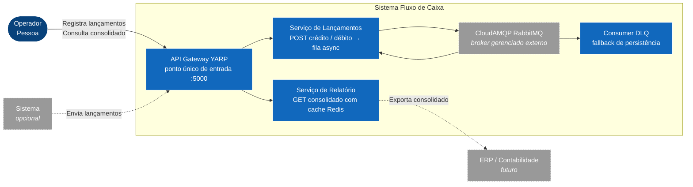
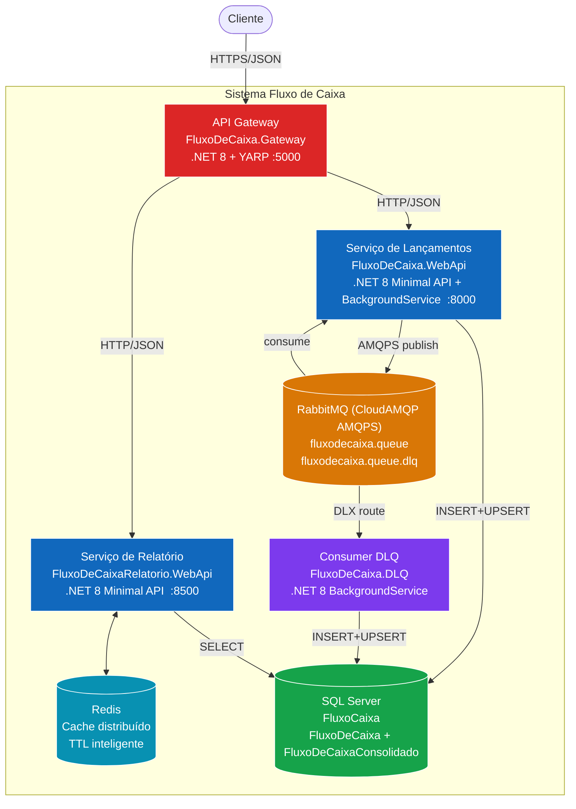
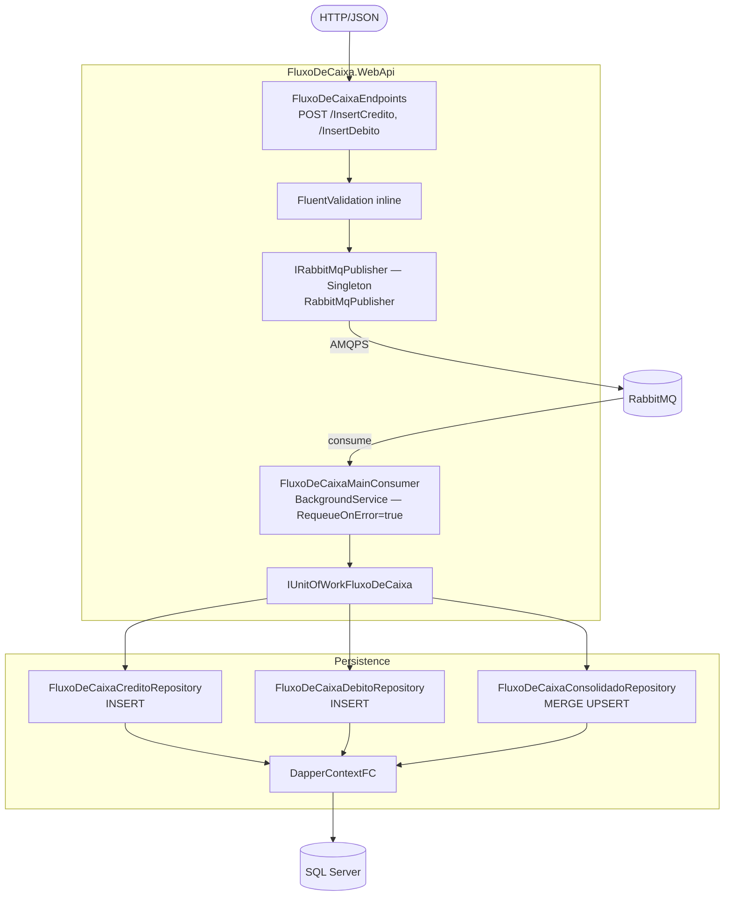
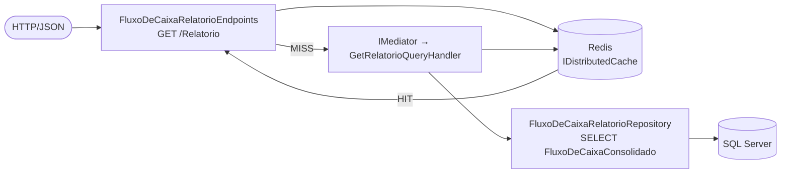
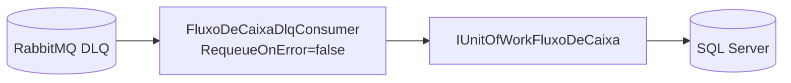
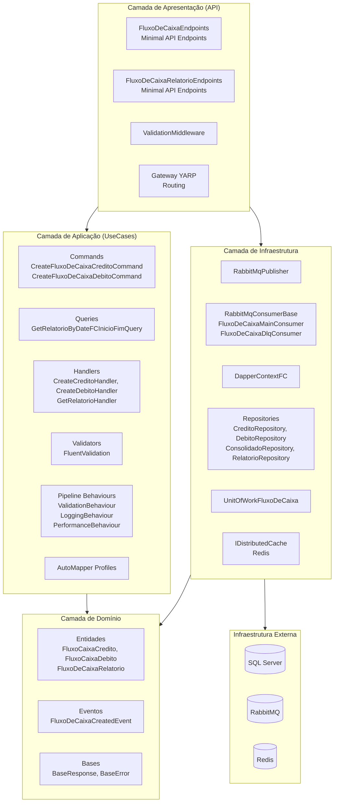
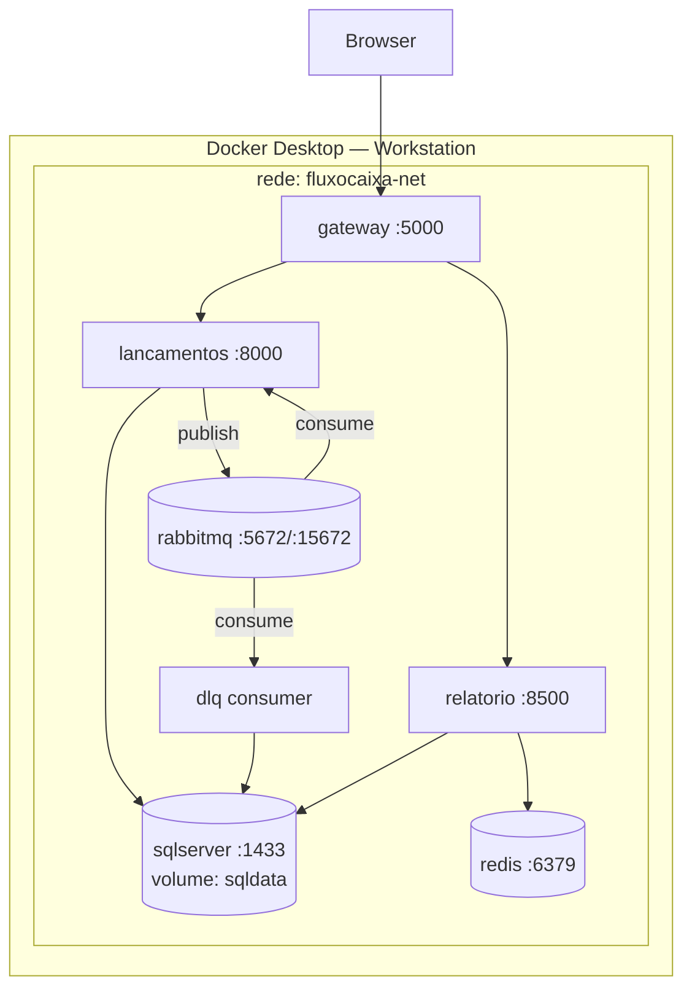
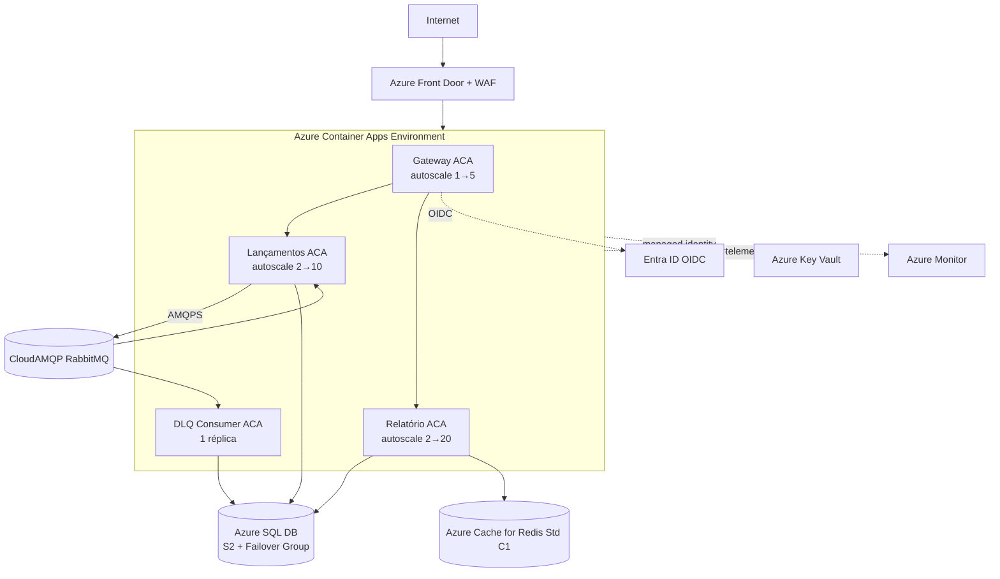
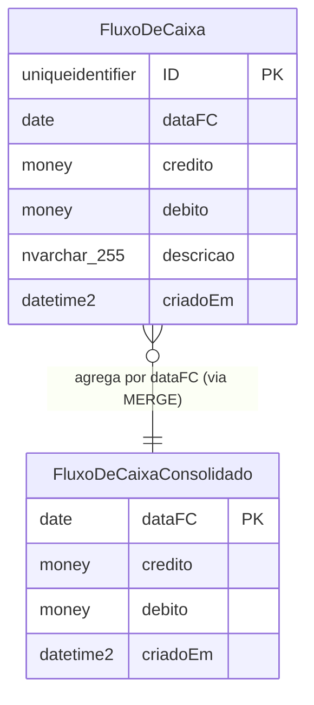
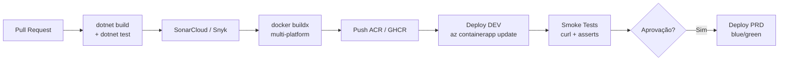

# Documento de Arquitetura de Software (SAD)

**Projeto:** Plataforma de Fluxo de Caixa  
**Versão:** 1.0  
**Data:** 26/04/2026  
**Autor:** Equipe de Arquitetura
**Status:** Aprovado

---

## Índice

1. [Introdução](#1-introdução)  
   1.1 [Finalidade](#11-finalidade)  
   1.2 [Escopo](#12-escopo)  
   1.3 [Definições, Acrônimos e Abreviações](#13-definições-acrônimos-e-abreviações)  
2. [Representação Arquitetural — Modelo C4](#2-representação-arquitetural--modelo-c4)  
   2.1 [Visão de Contexto (Nível 1)](#21-visão-de-contexto-nível-1)  
   2.2 [Visão de Contêineres (Nível 2)](#22-visão-de-contêineres-nível-2)  
   2.3 [Visão de Componentes (Nível 3)](#23-visão-de-componentes-nível-3)  
3. [Metas e Restrições Arquiteturais](#3-metas-e-restrições-arquiteturais)  
4. [Conjunto de Microsserviços](#4-conjunto-de-microsserviços)  
5. [Visão Lógica](#5-visão-lógica)  
   5.1 [Diagrama de Pacotes/Camadas](#51-diagrama-de-pacotescamadas)  
6. [Visão de Implantação (Deployment)](#6-visão-de-implantação-deployment)  
   6.1 [Infraestrutura Cloud/On-premise](#61-infraestrutura-cloudon-premise)  
7. [Visão de Dados](#7-visão-de-dados)  
   7.1 [Modelagem de Dados](#71-modelagem-de-dados)  
8. [Infraestrutura e Deploy](#8-infraestrutura-e-deploy)  
9. [Observabilidade e Operação](#9-observabilidade-e-operação)  
10. [Segurança](#10-segurança)  
11. [Plano de Evolução](#11-plano-de-evolução)  
12. [Decisões Arquiteturais (ADRs)](#12-decisões-arquiteturais-adrs)  
13. [Referências](#13-referências)

---

## 1. Introdução

### 1.1 Finalidade

Este documento fornece uma visão geral abrangente da arquitetura do sistema **Fluxo de Caixa** — plataforma de controle financeiro. Detalha os componentes, integrações, padrões adotados, decisões de design e roadmap de evolução.

Seguindo o modelo **C4** para descrição arquitetural em múltiplos níveis de abstração, complementado por diagramas UML de sequência e diagramas de deployment.


### 1.2 Escopo

Aplica-se ao sistema de **controle de lançamentos e consolidado diário**, composto por:

- **Serviço de Lançamentos** (`FluxoDeCaixa.WebApi`) — recebe créditos e débitos via HTTP e os publica em fila RabbitMQ para processamento assíncrono.
- **Serviço de Relatório** (`FluxoDeCaixaRelatorio.WebApi`) — consulta o consolidado diário com cache Redis.
- **API Gateway** (`FluxoDeCaixa.Gateway`) — ponto único de entrada via YARP.
- **Consumer DLQ** (`FluxoDeCaixa.DLQ`) — processa mensagens que falharam na fila principal.
- **Infraestrutura compartilhada** — SQL Server, RabbitMQ (CloudAMQP), Redis.

### 1.3 Definições, Acrônimos e Abreviações

| Termo | Definição |
|---|---|
| **SAD** | Software Architecture Document — este documento |
| **API** | Application Programming Interface |
| **CQRS** | Command and Query Responsibility Segregation |
| **DLQ** | Dead Letter Queue — fila de mensagens mortas/rejeitadas |
| **DLX** | Dead Letter Exchange — roteador RabbitMQ para DLQ |
| **UPSERT** | Operação de INSERT ou UPDATE atômico (SQL MERGE) |
| **MediatR** | Biblioteca .NET para padrão Mediator |
| **YARP** | Yet Another Reverse Proxy — proxy reverso da Microsoft |
| **TPS / req/s** | Transações por Segundo / Requisições por Segundo |
| **TTL** | Time-To-Live — tempo de vida de uma entrada em cache |
| **AMQPS** | Advanced Message Queuing Protocol Secure (AMQP over TLS) |
| **BackgroundService** | Serviço de longa duração gerenciado pelo Host .NET |
| **Testcontainers** | Biblioteca para containers Docker efêmeros em testes |
| **UUIDv7** | UUID versão 7 (RFC 9562) com timestamp embutido — bom para índices B-tree |

---

## 2. Representação Arquitetural — Modelo C4

Adota-se o **Modelo C4** (Context → Containers → Components → Code) para descrição arquitetural em quatro níveis de abstração progressiva.

### 2.1 Visão de Contexto (Nível 1)

> Mostra o sistema como uma caixa preta e seus relacionamentos com atores externos.



**Atores:**

| Ator | Tipo | Interação |
|---|---|---|
| Sistema POS | Sistema externo (opcional) | Dispara lançamentos automaticamente após venda |
| ERP / Contabilidade | Sistema externo (futuro) | Consome o consolidado para fechamento contábil |
| CloudAMQP | Broker externo gerenciado | Intermedia a comunicação assíncrona entre Lançamentos e DLQ |

---

### 2.2 Visão de Contêineres (Nível 2)

> Abre o sistema para mostrar os processos executáveis e datastores.



**Tabela de contêineres:**

| Container | Tecnologia | Porta | Responsabilidade |
|---|---|---|---|
| API Gateway | .NET 8 + YARP 2.3 | 5000 | Roteamento, ponto único de entrada, Swagger agregado, segurança autenticação OAuth2 JWT |
| Serviço de Lançamentos | .NET 8 + MediatR + Dapper + RabbitMQ.Client | 8000 | Valida, publica na fila; consumer BackgroundService que persiste + faz UPSERT |
| Serviço de Relatório | .NET 8 + MediatR + Dapper + StackExchange.Redis | 8500 | GET consolidado com Cache-on-First-Hit Redis |
| Consumer DLQ | .NET 8 BackgroundService + RabbitMQ.Client + Dapper | — | Segunda tentativa de persistência |
| RabbitMQ | CloudAMQP AMQPS | 5672 / 15672 | Broker com Dead-Letter Exchange |
| Redis | StackExchange.Redis 2.7 | 6379 | Cache distribuído com TTL inteligente |
| SQL Server | SQL Server 2022 | 1433 | Persistência durável — lançamentos e consolidado |

---

### 2.3 Visão de Componentes (Nível 3)

> Abre cada container para mostrar seus componentes internos.

#### Serviço de Lançamentos



#### Serviço de Relatório com estratégia de cache



#### Consumer DLQ - Pattern Dead Letter



---

## 3. Metas e Restrições Arquiteturais

### 3.1 Requisitos Não-Funcionais (RNF)

| ID | Categoria | Requisito | Como é atendido |
|---|---|---|---|
| RNF-01 | Disponibilidade | O Serviço de Lançamentos **não deve ficar indisponível** se o Relatório cair | Processos separados; sem comunicação direta |
| RNF-02 | Escalabilidade | Relatório absorve **50 req/s** com < 5% de perda | Redis Cache-on-First-Hit elimina >99% das queries ao SQL |
| RNF-03 | Resiliência de Escrita | Nenhum lançamento deve ser perdido mesmo com falha do SQL | RabbitMQ retém mensagens + DLQ garante segunda tentativa |
| RNF-04 | Latência de Escrita | Lançamento deve responder ao cliente em < 100ms | Publicação na fila é assíncrona — endpoint responde imediatamente após publish |
| RNF-05 | Manutenibilidade | Código testável, em camadas, padrões claros | Clean Architecture + CQRS + MediatR + xUnit/Testcontainers |
| RNF-06 | Segurança | Conformidade LGPD; dados financeiros protegidos | TLS/AMQPS; secrets via Key Vault; autenticação JWT (roadmap) |
| RNF-07 | Observabilidade | Rastreabilidade de lançamentos ponta a ponta | CorrelationId em cada TransacaoMessage; LoggingBehaviour; PerformanceBehaviour |

### 3.2 Restrições

| Restrição | Descrição |
|---|---|
| **Stack tecnológica** | .NET 8, SQL Server, RabbitMQ, Redis |
| **Banco relacional obrigatório** | SQL Server como repositório de lançamentos (desenvolvimento) |
| **Sem front-end** | Sistema expõe apenas APIs REST; front-end é responsabilidade de outro time |
| **CloudAMQP** | Broker RabbitMQ gerenciado — sem gestão de cluster próprio |
| **Conformidade LGPD** | Dados financeiros do comerciante tratados como dados sensíveis |

---

## 4. Conjunto de Microsserviços

| Microsserviço | Projeto | Porta | Papel |
|---|---|---|---|
| **API Gateway** | `FluxoDeCaixa.Gateway` | 5000 | Reverse proxy YARP; ponto único de entrada; segurança OAuth2 JWT |
| **Lançamentos** | `FluxoDeCaixa.WebApi` | 8000 | Write side: recebe e publica lançamentos; consumer BackgroundService |
| **Relatório** | `FluxoDeCaixaRelatorio.WebApi` | 8500 | Read side: consolidado diário com cache Redis |
| **Consumer DLQ** | `FluxoDeCaixa.DLQ` | — | Fallback: persiste mensagens mortas da fila principal |

**Assemblies compartilhados (bibliotecas internas):**

| Assembly | Papel |
|---|---|
| `FluxoDeCaixa.Domain` | Entidades de domínio (`FluxoCaixa`, `FluxoDeCaixaRelatorio`) e eventos |
| `FluxoDeCaixa.Application.Dto` | DTOs de leitura (`FluxoDeCaixaRelatorioDto`) |
| `FluxoDeCaixa.Application.Interface` | Contratos de repositórios (`IFluxoDeCaixaRepository`, `IUnitOfWorkFluxoDeCaixa`) |
| `FluxoDeCaixa.Application.UseCases` | Handlers CQRS, Validators FluentValidation, Pipeline Behaviours |
| `FluxoDeCaixa.Persistence` | Repositórios Dapper (CRUD + UPSERT) |
| `FluxoDeCaixa.Infrastructure` | `RabbitMqPublisher`, `RabbitMqConsumerBase`, `RabbitMqSettings`, `DateOnlyTypeHandler` |
| `FluxoDeCaixa.Tests` | Suíte xUnit — Validators, Handlers, Repositories, Publisher |

---

## 5. Visão Lógica

O sistema adota **Clean Architecture** em camadas concêntricas, combinada com o padrão **CQRS** via MediatR.

### 5.1 Diagrama de Pacotes/Camadas



### Regras de dependência (Clean Architecture)
- **Domínio** não depende de ninguém.
- **Aplicação** depende apenas do Domínio e das interfaces de Infraestrutura.
- **Infraestrutura** implementa as interfaces definidas na Aplicação.
- **API (Apresentação)** depende da Aplicação e, minimamente, da Infraestrutura para injeção de dependência.

---

## 6. Visão de Implantação (Deployment)

### 6.1 Infraestrutura Cloud/On-premise

#### Ambiente Local (Docker Compose)



#### Ambiente de Produção Recomendado (Azure Container Apps)



---

## 7. Visão de Dados

### 7.1 Modelagem de Dados

O banco de dados `FluxoCaixa` (SQL Server) contém duas tabelas:

#### Tabela `[dbo].[FluxoDeCaixa]` — lançamentos individuais

| Coluna | Tipo | Constraint | Descrição |
|---|---|---|---|
| `ID` | `uniqueidentifier` | PK CLUSTERED | UUIDv7 gerado server-side (timestamp embutido) |
| `dataFC` | `date` | NOT NULL | Data do lançamento (DateOnly no .NET) |
| `credito` | `money` | NOT NULL DEFAULT 0 | Valor do crédito (entrada) |
| `debito` | `money` | NOT NULL DEFAULT 0 | Valor do débito (saída) |
| `descricao` | `nvarchar(255)` | NOT NULL | Descrição do lançamento (1–255 chars) |
| `criadoEm` | `datetime2(7)` | NOT NULL DEFAULT sysutcdatetime() | Timestamp de criação UTC |

```sql
CREATE TABLE [dbo].[FluxoDeCaixa] (
    [ID]        uniqueidentifier NOT NULL,
    [dataFC]    date             NOT NULL,
    [credito]   money            NOT NULL DEFAULT 0,
    [debito]    money            NOT NULL DEFAULT 0,
    [descricao] nvarchar(255)    NOT NULL,
    [criadoEm]  datetime2(7)     NOT NULL DEFAULT sysutcdatetime(),
    PRIMARY KEY CLUSTERED ([ID] ASC)
);
```

#### Tabela `[dbo].[FluxoDeCaixaConsolidado]` — read model (saldo diário)

| Coluna | Tipo | Constraint | Descrição |
|---|---|---|---|
| `dataFC` | `date` | PK CLUSTERED DESC | Data do consolidado (1 registro por dia) |
| `credito` | `money` | NOT NULL DEFAULT 0 | Soma acumulada de créditos do dia |
| `debito` | `money` | NOT NULL DEFAULT 0 | Soma acumulada de débitos do dia |
| `criadoEm` | `datetime2(7)` | NOT NULL DEFAULT sysutcdatetime() | Última atualização UTC |

```sql
CREATE TABLE [dbo].[FluxoDeCaixaConsolidado] (
    [dataFC]   date         NOT NULL,
    [credito]  money        NOT NULL DEFAULT 0,
    [debito]   money        NOT NULL DEFAULT 0,
    [criadoEm] datetime2(7) NOT NULL DEFAULT sysutcdatetime(),
    PRIMARY KEY CLUSTERED ([dataFC] DESC)
);
```

#### Operação UPSERT (MERGE) — atualização atômica do consolidado

```sql
MERGE [dbo].[FluxoDeCaixaConsolidado] AS target
USING (SELECT @dataFc AS dataFC, @credito AS credito, @debito AS debito) AS source
  ON target.dataFC = source.dataFC
WHEN MATCHED THEN
    UPDATE SET
        credito  = target.credito + source.credito,
        debito   = target.debito  + source.debito,
        criadoEm = SYSUTCDATETIME()
WHEN NOT MATCHED THEN
    INSERT (dataFC, credito, debito, criadoEm)
    VALUES (source.dataFC, source.credito, source.debito, SYSUTCDATETIME());
```

#### Diagrama ER



#### Cache Redis — estrutura de chaves

| Chave | Tipo | TTL | Conteúdo |
|---|---|---|---|
| `fluxodecaixa:relatorio:{inicio}:{fim}` | String (JSON) | 365 dias (passado) / meia-noite (atual) | `BaseResponse<IEnumerable<FluxoDeCaixaRelatorioDto>>` serializado |

---

## 8. Infraestrutura e Deploy

### 8.1 Containers Docker

| Serviço | Imagem Base | Portas | Volumes |
|---|---|---|---|
| Gateway | `mcr.microsoft.com/dotnet/aspnet:8.0` | 5000 | — |
| Lançamentos | `mcr.microsoft.com/dotnet/aspnet:8.0` | 8000 | — |
| Relatório | `mcr.microsoft.com/dotnet/aspnet:8.0` | 8500 | — |
| DLQ Consumer | `mcr.microsoft.com/dotnet/aspnet:8.0` | — | — |
| SQL Server | `mcr.microsoft.com/mssql/server:2022-latest` | 1433 | `sqldata:/var/opt/mssql` |
| RabbitMQ | `rabbitmq:3.13-management` | 5672, 15672 | — |
| Redis | `redis:7-alpine` | 6379 | — |

### 8.2 Pipeline CI/CD



### 8.3 Configurações por ambiente

| Variável | DEV | PRD |
|---|---|---|
| `ASPNETCORE_ENVIRONMENT` | `Development` | `Production` |
| `ConnectionStrings__FluxoDeCaixaConnection` | Local SQL Server | Azure SQL (via Key Vault reference) |
| `RabbitMQ__ConnectionString` | `amqp://localhost:5672` | CloudAMQP AMQPS (via Key Vault) |
| `Redis__ConnectionString` | `localhost:6379` | Azure Cache for Redis (via Key Vault) |

---

## 9. Observabilidade e Operação

### 9.1 Logging

| Componente | O que loga | Nível |
|---|---|---|
| `LoggingBehaviour` | Request/Response de cada Command e Query (JSON) | `Information` |
| `PerformanceBehaviour` | Tempo de execução; alerta se > 10ms | `Warning` |
| `FluxoDeCaixaMainConsumer` | Mensagens recebidas, processadas, rejeitadas (com deliveryTag e CorrelationId) | `Information` / `Error` |
| `FluxoDeCaixaDlqConsumer` | Mensagens DLQ processadas ou descartadas | `Warning` / `Error` |
| `RabbitMqPublisher` | Erros de publicação | `Error` |

**Formato de log:** JSON estruturado (Serilog recomendado) → Application Insights / ELK / Loki.

### 9.2 Rastreabilidade

- **CorrelationId** em cada `TransacaoMessage` — gerado no endpoint de Lançamentos, propagado até o consumer e DLQ.
- Permite correlacionar um lançamento recebido via HTTP com sua persistência no SQL via log do consumer.

### 9.3 Health Checks (roadmap)

```csharp
builder.Services.AddHealthChecks()
    .AddSqlServer(connectionString)
    .AddRedis(redisConnectionString)
    .AddRabbitMQ(rabbitMqUri);

app.MapHealthChecks("/healthz");
app.MapHealthChecks("/healthz/ready", new HealthCheckOptions { Predicate = check => check.Tags.Contains("ready") });
```

### 9.4 Métricas recomendadas

| Métrica | Fonte | Alerta |
|---|---|---|
| Tamanho da fila `fluxodecaixa.queue` | RabbitMQ Management API | > 1000 mensagens → escalar consumer |
| Tamanho da DLQ `fluxodecaixa.queue.dlq` | RabbitMQ Management API | > 0 → investigar imediatamente |
| Latência P95 do endpoint `/InsertCredito` | App Insights | > 500ms |
| Cache hit rate do Redis | Redis INFO | < 90% → ajustar TTL |
| Taxa de erros HTTP | YARP / App Insights | > 1% → alertar |

---

## 10. Segurança

### 10.1 Superfície de ataque e controles

| Vetor | Controle atual | Roadmap |
|---|---|---|
| **Comunicação externa** | HTTPS terminado no Gateway | mTLS interno entre microsserviços |
| **Broker RabbitMQ** | AMQPS (TLS) via CloudAMQP | Rotação de credenciais via Key Vault |
| **SQL Server** | Connection string com usuário limitado (sem `sa`) | Azure AD authentication + Managed Identity |
| **Redis** | Rede privada (VNet / bridge Docker) | AUTH + TLS (Azure Cache for Redis) |
| **Autenticação de usuários** | Não implementada (roadmap) | JWT via Azure AD / Keycloak no Gateway |
| **Autorização** | Não implementada (roadmap) | RBAC no Gateway (comerciante vs. auditor) |
| **Dados sensíveis** | Valores financeiros em colunas `money` (sem PII direto) | Criptografia em repouso (TDE Azure SQL) |
| **Injeção SQL** | Dapper com parâmetros nomeados (`@param`) — sem concatenação | SAST no CI/CD (SonarCloud) |
| **Validação de entrada** | FluentValidation em todos os endpoints | Fuzzing no CI |
| **Secrets** | `.gitignore` nas `appsettings.Development.json` | Azure Key Vault references no runtime |

### 10.2 Conformidade LGPD

- Dados financeiros de comerciantes são dados **sensíveis de negócio** (não dados pessoais diretos de pessoas físicas, mas requerem proteção).
- Controles: acesso restrito por papel (roadmap), logs de auditoria com CorrelationId, retenção definida por política (ex.: 5 anos para dados contábeis).

---

## 11. Plano de Evolução

### 11.1 Roadmap técnico

| Fase | Item | Prioridade | Complexidade |
|---|---|---|---|
| **v2.1** | Autenticação JWT no Gateway (Azure AD / Keycloak) | Alta | Média |
| **v2.1** | Health checks em todos os serviços + dashboard Grafana | Alta | Baixa |
| **v2.1** | Rate limiting no Gateway (`AspNetCoreRateLimit`) | Média | Baixa |
| **v2.2** | Observabilidade distribuída — OpenTelemetry + Jaeger / Zipkin | Alta | Média |
| **v2.2** | Circuit Breaker no Gateway (Polly) para Lançamentos e Relatório | Média | Média |
| **v2.3** | Separação de banco: `FluxoDeCaixaConsolidado` → banco de leitura dedicado (CQRS físico) | Média | Alta |
| **v2.3** | Outbox Pattern para garantia ACID entre INSERT e publish RabbitMQ | Média | Alta |
| **v3.0** | Novo bounded context: **Conciliação Bancária** | Baixa | Alta |
| **v3.0** | Autoscaling baseado em eventos (KEDA) — escala consumer pelo tamanho da fila | Média | Média |
| **Contínuo** | Cobertura de testes > 80% (adicionar testes de integração de endpoint) | Alta | Baixa |

### 11.2 Dívidas técnicas conhecidas

| Débito | Impacto | Mitigação atual |
|---|---|---|
| Assemblies compartilhados entre Lançamentos e Relatório | Acoplamento de deploy (não é microsserviço puro) | Documentado em ADR-002; aceitável nesta fase |
| `PerformanceBehaviour` com threshold de 10ms (muito agressivo) | Muitos warnings em produção | Configurar via `appsettings.json` por ambiente |
| Sem Outbox Pattern — janela de perda entre endpoint e publish | Mensagem pode se perder se o processo morrer após `Results.Ok` mas antes do publish | DLQ mitiga parcialmente; Outbox no roadmap v2.3 |
| SQL Server em container Docker para dev | Não reflete produção gerenciada | Azure SQL em staging |

---

## 12. Decisões Arquiteturais (ADRs)

| ADR | Título | Status | Data |
|---|---|---|---|
| [ADR-001](../decisoes/ADR-001-microsservicos.md) | Adotar arquitetura de Microsserviços com API Gateway | Aceita | 2026-04-26 |
| [ADR-002](../decisoes/ADR-002-cqrs-mediatr.md) | Adotar CQRS leve com MediatR | Aceita | 2026-04-26 |
| [ADR-003](../decisoes/ADR-003-dapper.md) | Persistência com Dapper (em vez de EF Core) | Aceita | 2026-04-26 |
| [ADR-004](../decisoes/ADR-004-yarp-gateway.md) | API Gateway com YARP (Microsoft) | Aceita | 2026-04-26 |
| [ADR-005](../decisoes/ADR-005-uuidv7.md) | Geração de ID com UUIDv7 | Aceita | 2026-04-26 |
| [ADR-006](../decisoes/ADR-006-resiliencia.md) | Estratégia de Resiliência | Aceita | 2026-04-26 |
| [ADR-007](../decisoes/ADR-007-rabbitmq-async.md) | Mensageria Assíncrona com RabbitMQ (CloudAMQP) | **Aceita** | **2026-04-27** |
| [ADR-008](../decisoes/ADR-008-redis-cache.md) | Cache Distribuído Redis com TTL Inteligente | **Aceita** | **2026-04-27** |
| [ADR-009](../decisoes/ADR-009-testcontainers.md) | Estratégia de Testes com xUnit + NSubstitute + Testcontainers | **Aceita** | **2026-04-27** |

### Resumo dos ADRs principais

**ADR-001 — Microsserviços + API Gateway:** Processos separados garantem isolamento de falhas (RNF-01). YARP como gateway. Banco compartilhado nesta versão com path para database-per-service.

**ADR-002 — CQRS com MediatR:** Commands (escrita) e Queries (leitura) separados. Pipeline Behaviours centralizam validação, log e performance. Handlers são puros e facilmente testáveis.

**ADR-003 — Dapper:** Micro-ORM mais rápido, explícito revisável por DBA. Performance adequada para 50 req/s com tabela pré-agregada.

**ADR-007 — RabbitMQ:** Pipeline assíncrono decouples escrita do banco. Endpoint responde imediatamente após publish. DLQ garante segunda tentativa de persistência. `RequeueOnError=false` no DLQ evita loop infinito.

**ADR-008 — Redis:** Cache-on-First-Hit com TTL inteligente. Períodos passados: TTL 365 dias. Período atual: TTL até meia-noite. Elimina >99% das queries ao SQL no endpoint de relatório.

**ADR-009 — Testcontainers:** Camadas de teste: unitários (NSubstitute) + integração com containers efêmeros (SQL Server e RabbitMQ). CI/CD executa `dotnet test` sem dependências externas.

---

## 13. Referências

| Recurso | URL / Localização |
|---|---|
| Modelo C4 | https://c4model.com |
| YARP Documentation | https://microsoft.github.io/reverse-proxy/ |
| RabbitMQ Dead Letter | https://www.rabbitmq.com/dlx.html |
| StackExchange.Redis | https://stackexchange.github.io/StackExchange.Redis/ |
| Testcontainers .NET | https://dotnet.testcontainers.org/ |
| MediatR | https://github.com/jbogard/MediatR |
| FluentValidation | https://docs.fluentvalidation.net/ |
| Dapper | https://github.com/DapperLib/Dapper |
| SQL MERGE (UPSERT) | https://learn.microsoft.com/sql/t-sql/statements/merge-transact-sql |
| Diagramas C4 (nível 1) | `docs/arquitetura/c4/01-contexto.md` |
| Diagramas C4 (nível 2) | `docs/arquitetura/c4/02-containers.md` |
| Diagramas C4 (nível 3) | `docs/arquitetura/c4/03-componentes.md` |
| Diagramas C4 (nível 4) | `docs/arquitetura/c4/04-codigo.md` |
| Diagrama de Deployment | `docs/arquitetura/c4/05-deploy.md` |
| Sequência — Lançamento | `docs/arquitetura/uml/sequencia-lancamento.md` |
| Sequência — Relatório | `docs/arquitetura/uml/sequencia-relatorio.md` |
| Script SQL | `Sql/Create CML.sql` |
| ADRs | `docs/decisoes/ADR-00*.md` |
