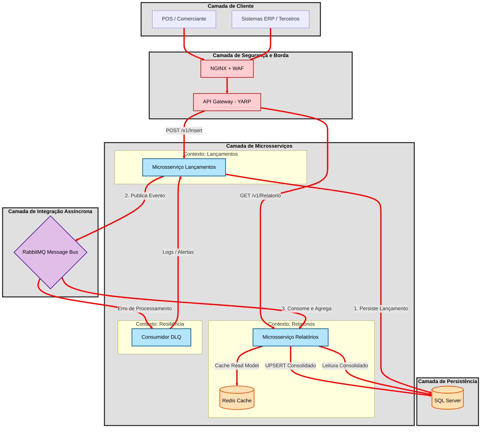
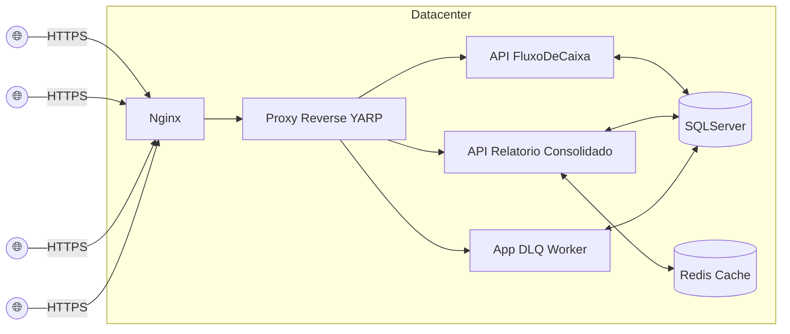
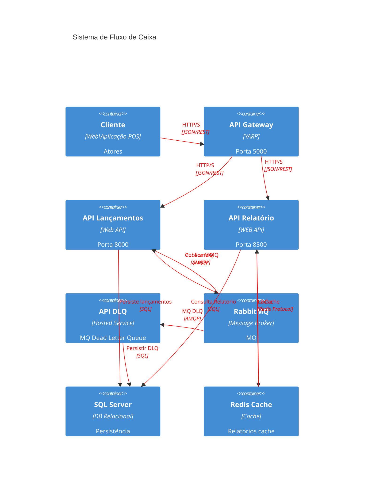

# Documento de Arquitetura da Solução (SAD)

**Nome do projeto:** Lancamentos de Fluxo de Caixa 
**Resposável técnico:** Equipe de arquitetura 
**Versão do Documento:** 1.0 
**Ultima Atualização:** 06/05/2026 

## Índice
1. Introdução
2. Sumário Executivo
3. Entendimento do Problema de Negócio
4. Visão geral da arquitetura da solução
5. Estudo de Caso Empresarial
6. Resumo dos Requisitos (RF | RNF)
7. Projeto de solução de alto nível
8. Arquitetura Corporativa
9. Arquitetura de solução detalhada
10. Arquitetura de Integração
11. Arquitetura de Dados
12. Arquitetura de Segurança
13. Requisitos de Infraestrutura
14. Justificativas Arquiteturais
15. Estratégias de Escalabilidade e Resiliência
16. Estratégia de Transição e Implementação
17. Riscos e Medidas de Mitigação
18. Conclusão
19. Glossário
20. Referências
    
## 1. Introdução

Este documento detalha a arquitetura da solução para o desafio de um comerciante que precisa registrar seus lançamentos de créditos e débitos e ter um relatório consolidade por dia, nomearemos o sistema com "Fluxo de Caixa", vamos decompor este documento SAD em domínios, justificativas arquiteturais, estratégias de escalabilidade e resiliência, e considerações para evolução futura e demais. A análise foi baseada no projeto desafio Banco Fornecido.

## 2. Sumário Executivo

Apresentamos uma arquitetura de microsserviços para um sistema de Fluxo de Caixa, projetado para gerenciar lançamentos financeiros (créditos e débitos) e gerar relatórios consolidados diários. A solução garante alta disponibilidade, escalabilidade e resiliência. Componentes chave incluem Gateways para roteamento, microsserviços dedicados para Lançamentos e Relatórios, comunicação assíncrona para tolerância a falhas, cache distribuído para otimização de performance em consultas de relatório. A arquitetura foi concebida para atender a requisitos não-funcionais rigorosos, como isolamento de falhas e throughput de 50 requisições por segundo, e possui um roadmap claro para evolução futura, incluindo segurança (OAuth2/JWT), observabilidade (OpenTelemetry) e funcionalidades avançadas. Este SAD serve como um guia técnico e estratégico para o desenvolvimento e operação do sistema, alinhado às melhores práticas de mercado e normativas regulatórias.

## 3. Entendimento do Problema de Negócio

O problema de negócio central abordado por esta solução é a **gestão eficiente e resiliente de lançamentos financeiros (créditos e débitos) e a geração de relatórios consolidados diários**. O sistema deve garantir que a capacidade de registrar novos lançamentos  (50 req/s com baixa perda) não seja comprometida pela demanda de consultas de relatórios, especialmente em cenários de alta carga. Requisitos não-funcionais críticos incluem isolamento de falhas, escalabilidade independente e alta disponibilidade para o serviço de lançamentos, além de performance para o serviço de relatórios.

## 4. Visão geral da arquitetura da solução

## 5. Estudo de Caso Empresarial

**Cenário:** Uma rede de pequenos e médios comerciantes (PMEs) que operam em diversos segmentos (varejo, serviços, alimentação) enfrenta desafios na gestão de seu fluxo de caixa diário. Eles precisam registrar rapidamente as transações de crédito e débito realizadas ao longo do dia e, ao final do expediente, ou a qualquer momento, acessar um relatório consolidado que mostre o saldo do dia. O volume de transações pode variar significativamente, com picos em datas comemorativas ou promoções. A falta de um sistema eficiente resulta em:

*   **Perda de visibilidade:** Dificuldade em saber o saldo atual e a posição financeira do dia.
*   **Erros manuais:** Lançamentos feitos em planilhas ou cadernos estão sujeitos a erros e retrabalho.
*   **Lentidão na tomada de decisão:** A demora na consolidação dos dados impede decisões rápidas sobre compras, pagamentos ou investimentos.
*   **Indisponibilidade:** Sistemas legados frequentemente travam ou ficam lentos em momentos de pico, impedindo o registro de transações críticas.

**Objetivo do Negócio:** Desenvolver uma solução que permita aos comerciantes registrar suas transações de forma ágil e confiável, e que forneça relatórios diários consolidados com alta disponibilidade e performance, mesmo sob picos de demanda. A solução deve ser escalável para suportar o crescimento da rede de comerciantes e resiliente a falhas pontuais em seus componentes, garantindo que a operação de registro de transações nunca seja interrompida.

**Benefícios Esperados:**

*   **Eficiência Operacional:** Redução do tempo e esforço para registrar e consolidar transações.
*   **Melhor Tomada de Decisão:** Acesso rápido e preciso a informações financeiras diárias.
*   **Redução de Erros:** Automatização do processo de registro e consolidação.
*   **Continuidade do Negócio:** Garantia de que as operações de registro de transações não serão impactadas por falhas em outros módulos do sistema.
*   **Escalabilidade:** Capacidade de atender a um número crescente de comerciantes e volume de transações sem degradação de performance.
*   
## 6. Resumo dos Requisitos

Os requisitos para o sistema de Fluxo de Caixa foram categorizados em funcionais (RF) e não-funcionais (RNF), conforme detalhado no documento `requisitos.md` [1].

### 6.1. Requisitos Funcionais (RF)

| ID | Descrição | Status | Notas |
|---|---|---|---|
| **RF-01** | Registrar lançamento de crédito | Implementado | Via `InsertCredito` endpoint [1] |
| **RF-02** | Registrar lançamento de débito | Implementado | Via `InsertDebito` endpoint [1] |
| **RF-03** | Consultar relatório consolidado por período | Implementado | Via `GetRelatorio` endpoint, suporta até 10 anos de dados [1] |
| **RF-04** | Atualizar lançamento | Roadmap | Esqueleto de comando existe [1] |
| **RF-05** | Excluir lançamento (soft-delete) | Roadmap | [1] |
| **RF-06** | Auditoria / histórico de alterações | Roadmap | [1] |
| **RF-07** | Exportar relatório (CSV / Excel / API → ERP) | Roadmap | [1] |

**Regras de Negócio:**

*   `dataFC` deve estar entre 2020-01-01 e 2030-12-31 [1].
*   `descricao` deve ter entre 1 e 255 caracteres [1].
*   `credito` e `debito` devem estar entre R$ 1,00 e R$ 9.999.999.999,99 [1].
*   Para relatórios, `fim` deve ser maior que `inicio` [1].

### 6.2. Requisitos Não-Funcionais (RNF)

Os requisitos não-funcionais (RNF) são fundamentais para a qualidade, desempenho e operabilidade do sistema de Fluxo de Caixa. Eles foram detalhados no documento `requisitos.md` [1] e são resumidos a seguir:

**Resumo (RNF)**

*   **Disponibilidade Independente (RNF-01)**: Lançamentos não pode ficar indisponível se Relatório cair.
*   **Throughput / Carga (RNF-02)**: Relatório suporta 50 req/s com no máximo 5% de perda.
*   **Latência (RNF-03)**: p95 < 200 ms para Lançamentos e < 100 ms para Relatório (com cache).
*   **Disponibilidade Global (RNF-04)**: Metas de 99,9% para Lançamentos e 99,5% para Relatório.
*   **Segurança (RNF-05)**: Validação de input, AuthN/AuthZ (roadmap), criptografia em trânsito e repouso, gerenciamento de segredos.
*   **Escalabilidade (RNF-06)**: Horizontal para serviços, vertical para SQL Server, com autoscaling.
*   **Observabilidade (RNF-07)**: Logs estruturados, métricas, traces distribuídos e alertas (roadmap).
*   **Manutenibilidade (RNF-08)**: Clean Architecture e cobertura de testes (roadmap).
*   **Portabilidade / Deploy (RNF-09)**: Conteinerização e compatibilidade com plataformas cloud.
*   **Conformidade (RNF-10)**: LGPD (mascaramento de PII) e normativas BACEN.## 7. Projeto de solução de alto nível

| ID | Categoria | Métrica | Meta | Estratégia |
|---|---|---|---|---|
| **RNF-01** | **Disponibilidade Independente** | MTTR Lançamentos quando Relatório falha | 0 (não há propagação) | Microsserviços separados, sem chamada síncrona [1] |
| **RNF-02** | **Throughput / Carga** | Throughput sustentado (Relatório) | ≥ 50 rps | Stateless + autoscale; cache Redis (roadmap); read model pré-agregada [1] |
| | | Taxa de erro sob pico (Relatório) | < 5% | Circuit breaker no Gateway (roadmap); rate limit [1] |
| **RNF-03** | **Latência** | p50 Lançamento | < 50 ms | [1] |
| | | p95 Lançamento | < 200 ms | [1] |
| | | p95 Relatório (com cache) | < 100 ms | [1] |
| | | p95 Relatório (sem cache) | < 250 ms | [1] |
| **RNF-04** | **Disponibilidade Global** | Lançamentos | 99,9% / mês | [1] |
| | | Relatório | 99,5% / mês | [1] |
| | | Gateway | 99,95% | [1] |
| **RNF-05** | **Segurança** | Validação de input | 100% endpoints | FluentValidation [1] |
| | | AuthN | JWT/OIDC no Gateway | Placeholder, integração roadmap [1] |
| | | AuthZ | Role-based (`admin`, `editor`) | Roadmap [1] |
| | | Criptografia em trânsito | TLS 1.2+ obrigatório | Gateway HTTPS [1] |
| | | Criptografia em repouso | TDE no SQL Server | Default em Azure SQL [1] |
| | | Secrets | Em Vault, nunca em git | Mover para Key Vault em produção (roadmap) [1] |
| | | Headers de segurança | `Strict-Transport-Security`, etc. | Adicionar middleware no Gateway (roadmap) [1] |
| | | Rate limit | 1000 rps / IP | Roadmap [1] |
| **RNF-06** | **Escalabilidade** | Horizontal | N réplicas | Serviços stateless [1] |
| | | Vertical | SQL Server | Escala de S0 → S2 → S4 → P1+ [1] |
| | | Autoscaling | KEDA HTTP scaler / ACA HTTP rule | Gatilho 30 rps por instância [1] |
| **RNF-07** | **Observabilidade** | Logs estruturados | `LoggingBehaviour` + ILogger | Implementado [1] |
| | | Logs centralizados | App Insights / Loki / ELK | Roadmap [1] |
| | | Métricas | Prometheus / App Insights metrics | Roadmap [1] |
| | | Traces distribuídos | OpenTelemetry → Jaeger / Tempo | Roadmap [1] |
| | | Alertas | Alertas em SLOs | Roadmap [1] |
| **RNF-08** | **Manutenibilidade** | Arquitetura | Clean Architecture estrita | [1] |
| | | Cobertura de testes | Mínimo 70% (App e Persistence) | Roadmap [1] |
| **RNF-09** | **Portabilidade / Deploy** | Imagens Docker | Prontas | `docker/Dockerfile.*` [1] |
| | | Compatibilidade | Azure Container Apps, AWS ECS, Kubernetes | [1] |
| **RNF-10** | **Conformidade** | LGPD | `descricao` pode conter PII | Mascarar em logs; avaliar criptografia em coluna (roadmap) [1] |

## 7.1 Desenho Lógico da Solução

A arquitetura é baseada em **microsserviços** e segue os princípios da **Clean Architecture (Onion Architecture)** e **CQRS (Command Query Responsibility Segregation)** lógico. A comunicação entre os serviços é predominantemente assíncrona para garantir desacoplamento e resiliência.

## 8. Arquitetura Corporativa

A arquitetura da solução para o sistema de Fluxo de Caixa é concebida em alinhamento com as normativas regulatórias brasileiras, em especial as diretrizes do **Banco Central do Brasil (BACEN)** para sistemas financeiros críticos e a **Lei Geral de Proteção de Dados (LGPD)** para o tratamento de dados pessoais. Este modelo arquitetural, baseado em microsserviços e comunicação assíncrona, é intrinsecamente adequado para atender a esses requisitos regulatórios.

### 8.1. Conformidade com Normativas BACEN

Para sistemas que lidam com transações financeiras, como o Fluxo de Caixa, as normativas do BACEN (e.g., Resolução Conjunta nº 1/2020, que trata de requisitos de segurança cibernética) impõem rigorosos padrões de segurança, resiliência e disponibilidade. A arquitetura proposta atende a esses requisitos através de:

*   **Isolamento de Falhas**: A decomposição em microsserviços garante que a falha de um componente (e.g., o serviço de Relatório) não comprometa a disponibilidade do serviço de Lançamentos, que é crítico para a operação financeira. Isso é um pilar para a continuidade do negócio [2].
*   **Alta Disponibilidade e Resiliência**: Estratégias como autoscaling, mensageria assíncrona com DLQ, e cache distribuído são fundamentais para garantir que o sistema permaneça operacional e responda a picos de demanda, minimizando interrupções e perdas de dados [3] [6].
*   **Segurança da Informação**: A implementação de camadas de segurança (WAF, OAuth2/JWT, TLS) e a gestão de segredos em ambientes controlados são essenciais para proteger as transações e os dados financeiros contra acessos não autorizados e ataques cibernéticos [12].
*   **Rastreabilidade e Auditoria**: O uso de Correlation IDs e logs estruturados (roadmap) facilita a rastreabilidade de transações, um requisito crucial para auditorias e conformidade regulatória [7].

### 8.2. Conformidade com LGPD

A LGPD (Lei nº 13.709/2018) exige que dados pessoais sejam tratados com segurança, transparência e em conformidade com os princípios de finalidade, adequação e necessidade. Embora o sistema de Fluxo de Caixa lide principalmente com dados transacionais, a `descricao` dos lançamentos pode, eventualmente, conter informações que se enquadrem como dados pessoais [1].

Para garantir a conformidade com a LGPD, a arquitetura incorpora:

*   **Segurança por Design**: Todas as medidas de segurança (criptografia em trânsito e em repouso, controle de acesso, WAF) contribuem para a proteção dos dados pessoais [12].
*   **Minimização de Dados**: O sistema é projetado para coletar apenas os dados estritamente necessários para a finalidade de gestão de fluxo de caixa.
*   **Anonimização/Pseudonimização (Roadmap)**: Para campos como `descricao` que podem conter PII (Personally Identifiable Information), está previsto no roadmap a avaliação de mascaramento em logs e, se necessário, criptografia em coluna para proteger esses dados [1].
*   **Controle de Acesso**: A implementação de autenticação (OAuth2/JWT) e autorização baseada em papéis (RBAC) garante que apenas usuários autorizados tenham acesso aos dados, de acordo com o princípio do menor privilégio [12].
*   **Observabilidade e Auditoria**: A capacidade de monitorar e auditar o acesso e o tratamento dos dados é fundamental para demonstrar conformidade e responder a incidentes de segurança [7].

Este modelo de arquitetura de microsserviços, com suas características de desacoplamento, resiliência e segurança em camadas, é o mais adequado para sistemas que operam em ambientes regulados como o financeiro, permitindo a evolução contínua sem comprometer a conformidade.

## 9. Arquitetura de solução detalhada

A arquitetura proposta e implementada no projeto segue o princípio de **Domain-Driven Design (DDD)**, identificando **Bounded Contexts** que encapsulam domínios de negócio específicos e suas respectivas capacidades. A solução está logicamente dividida em dois principais Bounded Contexts, suportados por um API Gateway e um mecanismo de processamento de mensagens assíncronas.

### 9.2. Bounded Contexts 

| Bounded Context | Descrição | Microsserviço Correspondente | Modelo de Dados | Capacidades de Negócio Principais |
|---|---|---|---|---|
| **Lançamentos** | Gerencia a criação e persistência de transações financeiras individuais (créditos e débitos). É o *write model* do sistema, focado na consistência transacional e na captura de fatos. | `FluxoDeCaixa.WebApi` | Entidades transacionais (`FluxoDeCaixaCredito`, `FluxoDeCaixaDebito`) | Captura de Lançamentos (CN-01.1), Integração com Sistemas (CN-05) |
| **Relatório Consolidado** | Responsável pela agregação e consulta de dados financeiros consolidados por período. É o *read model* do sistema, otimizado para consultas e performance. | `FluxoDeCaixaRelatorio.WebApi` | Read model pré-agregado (`FluxoDeCaixaRelatorio`) | Consolidação Financeira Diária (CN-02.1), Relatórios e Insights (CN-03) |
| **Processamento DLQ** | Trata mensagens de lançamentos que falharam no processamento inicial, garantindo que nenhuma transação seja perdida. | `FluxoDeCaixa.DLQ` | Mensagens de transação (`TransacaoMessage`) | Resiliência e Tolerância a Falhas (parte de CN-07) |
| **API Gateway** | Atua como um ponto de entrada unificado para os microsserviços, roteando requisições e agregando documentação. | `FluxoDeCaixa.Gateway` | N/A | Roteamento, Agregação de APIs, Segurança (roadmap) |

### 9.3 Capacidades de Negócio

As capacidades de negócio, conforme identificadas no documento `dominio-e-capacidades.md` [1], são:

*   **CN-01: Gestão de Lançamentos Financeiros**: Capturar, classificar, atualizar e excluir lançamentos. A solução atual foca na captura. 
*   **CN-02: Consolidação Financeira Diária**: Agregar movimentações por janela temporal. A solução implementa a consolidação diária. 
*   **CN-03: Relatórios e Insights**: Apresentar visão consolidada para decisão. A solução oferece um endpoint REST para relatórios. 
*   **CN-04: Auditoria e Compliance**: Registrar quem fez o quê, quando (roadmap). 
*   **CN-05: Integração com Sistemas**: Trocar dados com POS, ERP, contabilidade. A API REST aberta permite integração. 
*   **CN-06: Segurança e Acesso**: AuthN, AuthZ, criptografia (roadmap). 
*   **CN-07: Observabilidade Operacional**: Saber se está funcionando, com qual qualidade. Logs e performance via *Pipeline Behaviours* estão presentes. 

### 9.4. Componentes e Fluxo de Dados

1.  **Cliente (POS/Comerciante)**: Inicia as operações de crédito ou débito.
2.  **API Gateway (`FluxoDeCaixa.Gateway`)**: Recebe todas as requisições externas. Utiliza **YARP (Yet Another Reverse Proxy)** para rotear as chamadas para os microsserviços apropriados. Também agrega a documentação Swagger de todos os serviços [2].
3.  **Microsserviço de Lançamentos (`FluxoDeCaixa.WebApi`)**: 
    *   Recebe requisições de `InsertCredito` e `InsertDebito` via API Gateway.
    *   Valida as requisições usando `FluentValidation`.
    *   Publica uma `TransacaoMessage` (contendo os dados do lançamento) em uma fila **RabbitMQ** (`fluxodecaixa.queue`) de forma assíncrona [3].
    *   Responde ao cliente imediatamente com sucesso, garantindo baixa latência e alta disponibilidade, mesmo que o banco de dados esteja sob carga ou temporariamente indisponível.
4.  **Consumer Principal de Lançamentos (`FluxoDeCaixaMainConsumer` - HostedService dentro de `FluxoDeCaixa.WebApi`)**: 
    *   Consome mensagens da `fluxodecaixa.queue`.
    *   Persiste o lançamento no banco de dados (`FluxoDeCaixa`) usando **Dapper** e o padrão **Unit of Work** [4].
    *   Realiza um **UPSERT atômico** na tabela `FluxoDeCaixaConsolidado` para atualizar o saldo diário. Este UPSERT é crucial para manter o *read model* atualizado [5].
    *   Em caso de falha após `MaxRetries`, a mensagem é redirecionada para uma **Dead Letter Queue (DLQ)** [3].
5.  **Microsserviço de Relatório Consolidado (`FluxoDeCaixaRelatorio.WebApi`)**: 
    *   Recebe requisições para `GetRelatorio` via API Gateway.
    *   Implementa uma estratégia de **Cache-on-First-Hit** usando **Redis** (`IDistributedCache`) com um **TTL inteligente** [6].
    *   Se o dado estiver em cache, retorna-o imediatamente. Caso contrário, consulta a tabela `FluxoDeCaixaConsolidado` no banco de dados.
    *   A consulta é otimizada para *range-scan* em um índice clustered, garantindo alta performance [6].
6.  **Microsserviço de Processamento DLQ (`FluxoDeCaixa.DLQ`)**: 
    *   Um serviço separado que consome mensagens da `fluxodecaixa.queue.dlq`.
    *   Permite uma segunda tentativa de processamento para mensagens que falharam repetidamente no consumer principal, evitando perdas de dados [3].
7.  **Banco de Dados (SQL Server)**: 
    *   Atualmente, um único banco de dados é compartilhado, mas com tabelas logicamente separadas para o *write model* (`FluxoDeCaixa`) e o *read model* (`FluxoDeCaixaConsolidado`).
    *   A conexão é gerenciada via `DapperContextFC` [7].

### 9.5. Diagrama de Componentes (Modelo C4 - Nível 2: Containers)

## 10. Arquitetura de Integração

A arquitetura de integração do sistema de Fluxo de Caixa é projetada para garantir o desacoplamento entre os serviços, a resiliência na comunicação e a capacidade de interagir com sistemas externos de forma eficiente. As principais estratégias de integração são baseadas em APIs RESTful e mensageria assíncrona.

### 10.1. Integração Interna (Microsserviços)

*   **API Gateway (YARP)**: Atua como o ponto central de integração para as APIs dos microsserviços de Lançamentos e Relatórios. Ele roteia as requisições externas para os serviços internos apropriados, abstraindo a complexidade da topologia de microsserviços. O YARP também agrega a documentação Swagger, facilitando a descoberta e o consumo das APIs internas [2].
*   **Mensageria Assíncrona (RabbitMQ)**: A comunicação entre o microsserviço de Lançamentos e o processo de persistência é realizada de forma assíncrona via RabbitMQ. Isso garante que o serviço de Lançamentos possa responder rapidamente ao cliente, enquanto a persistência e a atualização do consolidado ocorrem em segundo plano. A fila de mensagens atua como um buffer, absorvendo picos de carga e aumentando a resiliência do sistema [3].
*   **Dead Letter Queue (DLQ)**: Parte integrante da estratégia de mensageria, a DLQ é utilizada para isolar mensagens que falharam no processamento, permitindo que sejam inspecionadas e reprocessadas sem impactar o fluxo principal de mensagens [3].

### 10.2. Integração Externa (com Sistemas de Terceiros)

Atualmente, a integração externa é facilitada pela exposição de APIs RESTful através do API Gateway, permitindo que sistemas como POS (Point of Sale) ou ERPs (Enterprise Resource Planning) consumam os serviços de registro de lançamentos e consulta de relatórios.

*   **APIs RESTful**: Os endpoints `InsertCredito`, `InsertDebito` e `GetRelatorio` são expostos via HTTP/S, utilizando JSON como formato de dados. Esta é uma abordagem padrão e amplamente aceita para integração com sistemas externos [1].

### 10.3. Padrões de Integração Aplicados

| Padrão de Integração | Descrição | Implementação na Solução |
|---|---|---|
| **API Gateway** | Ponto de entrada unificado para microsserviços, roteamento e agregação. | YARP (`FluxoDeCaixa.Gateway`) [2] |
| **Message Queue** | Desacoplamento de produtores e consumidores, resiliência e absorção de picos. | RabbitMQ (`fluxodecaixa.queue`) [3] |
| **Dead Letter Channel** | Tratamento de mensagens que falham no processamento. | `fluxodecaixa.queue.dlq` e `FluxoDeCaixa.DLQ` [3] |
| **Publish-Subscribe** | Publicação de eventos para múltiplos consumidores interessados. | Implícito na mensageria, com roadmap para Outbox Pattern para eventos de domínio [7] |
| **Cache-Aside** | Otimização de leitura de dados frequentemente acessados. | Redis Cache no serviço de Relatório [6] |

### 10.4. Roadmap de Evolução da Integração

O roadmap prevê a evolução da arquitetura de integração para suportar cenários mais complexos e robustos [7]:

*   **Outbox Pattern**: Para garantir a consistência transacional entre a persistência de dados e a publicação de eventos de domínio, garantindo que eventos sejam publicados apenas se a transação de banco de dados for bem-sucedida [7].
*   **Open Banking Integration**: Integração com APIs de bancos para conciliação automática de lançamentos, conforme as diretrizes do Open Banking [7].
*   **API Pública com Monetização**: Evolução do API Gateway para uma plataforma de API Management (e.g., Azure API Management, Apigee) para gerenciar planos de consumo, chaves de API e monetização para parceiros [7].

## 11. Arquitetura de Dados

A arquitetura de dados do sistema de Fluxo de Caixa é projetada para suportar os requisitos de persistência de transações, agregação de dados para relatórios e otimização de performance. A solução utiliza um banco de dados relacional (SQL Server) para persistência primária e um cache distribuído (Redis) para otimização de leitura.

### 11.1. Modelo de Dados Lógico

O sistema adota um modelo de dados que reflete a separação lógica entre o *write model* e o *read model*, característica do CQRS. Embora atualmente compartilhem o mesmo banco de dados físico, as tabelas são projetadas para finalidades distintas:

*   **Write Model (`FluxoDeCaixa`)**: Contém os lançamentos individuais de crédito e débito. Esta tabela é otimizada para operações de inserção (INSERT) e garante a integridade transacional dos fatos financeiros. Cada lançamento possui um `ID` único gerado com UUIDv7, que é ordenável e eficiente para indexação [1] [8].
*   **Read Model (`FluxoDeCaixaConsolidado`)**: Armazena os dados de fluxo de caixa já agregados por dia (`dataFC`, `credito`, `debito`). Esta tabela é otimizada para consultas de leitura (SELECT) e é a fonte de dados para o serviço de Relatório. A atualização desta tabela é realizada via um UPSERT atômico, garantindo que os dados consolidados estejam sempre atualizados com os lançamentos processados [5].

### 11.2. Tecnologias de Persistência

*   **SQL Server**: Escolhido como o banco de dados relacional principal devido à sua robustez, capacidade de lidar com transações ACID e suporte a recursos como índices clustered para otimização de consultas de range [2]. A conexão é gerenciada via `DapperContextFC`, que utiliza `SqlConnection` [9].
*   **Dapper**: Utilizado como micro-ORM para acesso a dados. O Dapper oferece alta performance e controle granular sobre as queries SQL, minimizando o *overhead* de um ORM completo e permitindo otimizações específicas para cada operação de banco de dados [2].
*   **Redis Cache**: Empregado como cache distribuído para o serviço de Relatório. O Redis é um armazenamento de dados em memória de alta performance, ideal para armazenar resultados de consultas frequentemente acessadas e reduzir a carga sobre o banco de dados primário [6].

### 11.3. Estrutura das Tabelas Principais

| Tabela | Propósito | Colunas Chave | Índices | Notas |
|---|---|---|---|---|
| `FluxoDeCaixa` | Armazenar lançamentos individuais (crédito/débito) | `ID` (PK, UUIDv7), `dataFC` | `ID` (Clustered), `dataFC` | Write Model, otimizado para INSERTs [1] |
| `FluxoDeCaixaConsolidado` | Armazenar saldos diários agregados | `dataFC` (PK) | `dataFC` (Clustered) | Read Model, otimizado para SELECTs de range [1] |

### 11.4. Gerenciamento de Conexões e Transações

*   **DapperContextFC**: Responsável por criar e gerenciar as conexões com o SQL Server [9] [10].
*   **Unit of Work**: O padrão Unit of Work agrega os repositórios garantindo que todas as operações relacionadas a uma única transação de negócio sejam tratadas como uma unidade atômica [4].

### 11.5. Roadmap de Evolução da Arquitetura de Dados

*   **Database per Service (Físico)**: Evolução para separar fisicamente os bancos de dados do *write model* e do *read model*, permitindo otimizações e escalabilidade ainda maiores para cada contexto [2] [7].
*   **Criptografia em Coluna**: Para dados sensíveis na coluna `descricao`, conforme requisitos da LGPD [1] [7].
*   **Políticas de Retenção de Dados**: Definição e implementação de políticas de retenção para dados históricos e de auditoria [1].
*   **Event Sourcing**: Avaliação da adoção de Event Sourcing para auditoria completa e capacidade de "rewind" do estado do sistema [7].

## 12. Arquitetura de Segurança

A segurança é um pilar fundamental da arquitetura do sistema de Fluxo de Caixa, implementada em múltiplas camadas para proteger os dados e as operações contra ameaças. As estratégias de segurança abrangem desde a borda da rede até o acesso aos dados, com foco em autenticação, autorização, proteção contra ataques e conformidade com regulamentações como LGPD e BACEN [1] [12].

### 12.1. Segurança na Camada de Borda (NGINX com WAF)

Considerando um cenário de produção onde o NGINX atua como um *reverse proxy* e *load balancer* frontal ao API Gateway, é crucial a implementação de um Web Application Firewall (WAF):

*   **NGINX com WAF**: O NGINX pode ser configurado com módulos de WAF (e.g., ModSecurity) ou integrado a soluções de WAF externas (e.g., Azure Front Door, AWS WAF). O WAF atua na camada de borda, inspecionando o tráfego HTTP/S e bloqueando ataques comuns da web, como injeção de SQL, Cross-Site Scripting (XSS), inclusão de arquivos e outras vulnerabilidades do OWASP Top 10, isso protege a infraestrutura subjacente e os microsserviços de ameaças conhecidas antes mesmo que cheguem ao API Gateway [12].
*   **Terminação TLS**: O NGINX também é responsável pela terminação TLS (HTTPS), garantindo que toda a comunicação externa seja criptografada em trânsito, isso protege a confidencialidade e a integridade dos dados trocados entre os clientes e o sistema [12].

### 12.2. Segurança na Camada do API Gateway (YARP com OAuth2/JWT)

O API Gateway (`FluxoDeCaixa.Gateway`), implementado com YARP, é o ponto ideal para centralizar a autenticação e autorização, aplicando políticas de segurança antes de rotear as requisições para os microsserviços:

*   **Autenticação com OAuth2 e JWT**: O YARP será configurado para integrar-se a um provedor de identidade (IdP) externo (e.g., Azure AD, Keycloak) utilizando o protocolo OAuth2. Após a autenticação bem-sucedida do usuário, o IdP emitirá um JSON Web Token (JWT). O Gateway validará este JWT (assinatura, emissor, audiência, expiração) para garantir a autenticidade do usuário [1] [12].
*   **Autorização Baseada em Papéis (RBAC)**: Uma vez validado o JWT, as *claims* contidas no token (especialmente a *claim* `role`) serão utilizadas para aplicar políticas de autorização. O Gateway pode verificar se o usuário possui os papéis necessários (`admin`, `editor`, etc.) para acessar um determinado endpoint ou recurso antes de encaminhar a requisição ao microsserviço de destino [1] [12].
*   **Propagação do JWT**: O JWT original ou um token interno (se necessário) será propagado do Gateway para os microsserviços via cabeçalho `Authorization`. Isso permite que os microsserviços realizem validações adicionais (defense-in-depth) e extraiam informações do usuário para lógica de negócio [12].
*   **Rate Limiting**: O Gateway pode implementar *rate limiting* para proteger os microsserviços contra sobrecarga e ataques de negação de serviço (DoS), limitando o número de requisições por cliente ou por período [1] [12].

### 12.3. Segurança nos Microsserviços

*   **Validação de Input**: Todos os endpoints dos microsserviços possuem validação de input rigorosa usando `FluentValidation`, prevenindo ataques como injeção de dados maliciosos [1] [12].
*   **Princípio do Menor Privilégio**: Os microsserviços e suas conexões com o banco de dados operam com as permissões mínimas necessárias para suas funções, reduzindo a superfície de ataque [12].
*   **Gerenciamento de Segredos**: Credenciais de banco de dados, chaves de API e outros segredos são armazenados em um cofre de segredos (e.g., Azure Key Vault, AWS Secrets Manager) e acessados via Managed Identity, evitando que sejam expostos no código ou em arquivos de configuração [1] [12].

### 12.4. Segurança no Banco de Dados

*   **SQL Parametrizado**: Todas as queries SQL utilizam parâmetros, eliminando o risco de SQL Injection [12].
*   **Criptografia em Repouso (TDE)**: O SQL Server utiliza Transparent Data Encryption (TDE) para criptografar os dados em repouso, protegendo-os contra acesso não autorizado ao armazenamento físico [12].
*   **Criptografia em Coluna (Roadmap)**: Para dados sensíveis na coluna `descricao`, a criptografia em coluna será avaliada e implementada conforme a necessidade de conformidade com a LGPD [1] [7].

### 12.5. Observabilidade e Resposta a Incidentes

*   **Logs de Segurança**: Logs estruturados e centralizados (roadmap) com mascaramento de PII são essenciais para monitorar eventos de segurança e detectar atividades suspeitas [1] [7].
*   **Alertas e Monitoramento**: Configuração de alertas para eventos de segurança (e.g., tentativas de login falhas, picos de tráfego anormais) e dashboards de segurança para visibilidade contínua [7].
*   **Plano de Resposta a Incidentes**: Um plano claro para contenção, erradicação, recuperação e post-mortem de incidentes de segurança é fundamental para minimizar o impacto de possíveis violações [12].

## 13. Requisitos de Infraestrutura

A infraestrutura que suporta o sistema de Fluxo de Caixa é projetada para garantir alta disponibilidade, escalabilidade e resiliência, utilizando princípios de computação em nuvem e automação. A escolha dos componentes de infraestrutura visa otimizar custos e performance, ao mesmo tempo em que atende aos requisitos não-funcionais críticos [6].

### 13.1. Opções de Implantação (Deployment)

O sistema é conteinerizado, o que oferece flexibilidade para implantação em diversas plataformas [1]:

*   **Ambiente de Desenvolvimento Local**: Utiliza Docker Compose para orquestrar todos os serviços (microsserviços, RabbitMQ, SQL Server, Redis) em um único host, facilitando o desenvolvimento e teste local [1].
*   **Ambiente de Produção (Cloud)**: Plataformas de orquestração de contêineres são as opções preferenciais:
    *   **Azure Container Apps (ACA)**: Oferece um ambiente gerenciado para microsserviços e contêineres, com autoscaling baseado em HTTP e eventos (KEDA), ideal para a arquitetura proposta [1].
    *   **Kubernetes (AKS, EKS, GKE)**: Para cenários com maior complexidade e necessidade de controle granular, um cluster Kubernetes pode ser utilizado. O sistema é compatível com os padrões do Kubernetes [1].
    *   **AWS ECS / Fargate**: Alternativa gerenciada para orquestração de contêineres na AWS.

### 13.2. Redes e Conectividade

*   **Rede Virtual Privada (VPC/VNet)**: Todos os componentes da solução (microsserviços, banco de dados, cache, broker de mensagens) devem ser implantados dentro de uma rede virtual privada para isolamento e segurança. A comunicação entre os serviços deve ocorrer internamente na rede virtual, sem exposição direta à internet [2].
*   **Sub-redes**: Segmentação da rede virtual em sub-redes para diferentes camadas (e.g., DMZ para NGINX/WAF, sub-rede de aplicação para microsserviços, sub-rede de dados para bancos de dados), aplicando listas de controle de acesso (ACLs) e grupos de segurança para restringir o tráfego [12].
*   **Load Balancers**: Utilização de balanceadores de carga (e.g., Azure Load Balancer, AWS ELB) para distribuir o tráfego entre as instâncias dos microsserviços, garantindo alta disponibilidade e escalabilidade horizontal [6].
*   **Firewall de Aplicação Web (WAF)**: Conforme detalhado na seção de segurança, um WAF (e.g., Azure Front Door com WAF, AWS WAF) deve ser posicionado na borda da rede para proteger contra ataques comuns da web [12].

### 13.3. Gerenciamento de DNS

*   **DNS Privado**: Para resolução de nomes internos dos serviços dentro da rede virtual, garantindo que os microsserviços se comuniquem usando nomes de domínio internos e não IPs estáticos [2].
*   **DNS Público**: Para o acesso externo ao API Gateway, com registros `A` ou `CNAME` apontando para o endereço público do WAF/Load Balancer. Utilização de provedores de DNS com alta disponibilidade e baixa latência.

### 13.4. Servidores e Recursos Computacionais

*   **Microsserviços (Lançamentos, Relatório, DLQ)**: Instâncias de contêineres (e.g., Azure Container Apps, pods Kubernetes) com recursos de CPU e memória configurados de acordo com a carga esperada. O autoscaling é fundamental para ajustar dinamicamente o número de instâncias [6].
*   **API Gateway (YARP)**: Implantado em instâncias de contêineres, com recursos dedicados para lidar com o volume de tráfego de entrada e roteamento [2].
*   **Banco de Dados (SQL Server)**: Serviço de banco de dados gerenciado (e.g., Azure SQL Database, AWS RDS for SQL Server) para alta disponibilidade, backups automáticos, patching e escalabilidade. A camada de serviço (e.g., S2, S4, P1+) deve ser escolhida com base nos requisitos de performance e throughput [1] [6].
*   **Cache Distribuído (Redis)**: Serviço de cache gerenciado (e.g., Azure Cache for Redis, AWS ElastiCache for Redis) para garantir alta performance e disponibilidade do cache [6].
*   **Broker de Mensagens (RabbitMQ)**: Serviço de broker de mensagens gerenciado (e.g., CloudAMQP, Azure Service Bus) para garantir a resiliência e escalabilidade da comunicação assíncrona [3].

### 13.5. Estratégias de Failover e Recuperação de Desastres

*   **Alta Disponibilidade (HA) Intra-região**: 
    *   **Microsserviços**: Implantados em múltiplas zonas de disponibilidade dentro de uma região, com balanceadores de carga distribuindo o tráfego. Em caso de falha de uma zona, o tráfego é automaticamente redirecionado para as zonas saudáveis [6].
    *   **Banco de Dados**: Configurado com replicação síncrona (e.g., Always On Availability Groups no SQL Server, ou HA nativo em serviços gerenciados) para failover automático em caso de falha do nó primário [6].
    *   **Redis/RabbitMQ**: Utilização de serviços gerenciados com HA embutida (clusters, replicação) [3] [6].
*   **Recuperação de Desastres (DR) Inter-regiões (Roadmap)**: Para cenários de desastre regional, um plano de DR pode incluir:
    *   **Active-Passive**: Uma região primária e uma secundária em standby. Em caso de falha da primária, um failover manual ou automatizado é acionado para a secundária. Isso implica em RTO (Recovery Time Objective) e RPO (Recovery Point Objective) maiores [6].
    *   **Active-Active**: Implantação da solução em múltiplas regiões, com tráfego distribuído entre elas. Oferece RTO e RPO próximos de zero, mas com maior complexidade e custo. Requer bancos de dados distribuídos (e.g., Azure Cosmos DB, multi-master replication) e estratégias de roteamento de tráfego global (e.g., Azure Traffic Manager, AWS Route 53 com políticas de roteamento geográfico) [7].
*   **Backups e Restauração**: Políticas de backup automatizadas para o banco de dados, com testes regulares de restauração para garantir a integridade dos dados e a capacidade de recuperação em caso de corrupção ou perda [6].

### 13.6. Monitoramento e Observabilidade da Infraestrutura

*   **Ferramentas de Monitoramento**: Integração com plataformas de monitoramento (e.g., Azure Monitor, AWS CloudWatch, Prometheus/Grafana) para coletar métricas de CPU, memória, rede, disco, e logs de todos os componentes da infraestrutura [7].
*   **Alertas**: Configuração de alertas baseados em limiares para identificar proativamente problemas de performance ou disponibilidade (e.g., alta utilização de CPU, baixa latência de rede, erros de disco) [7].
*   **Dashboards**: Criação de dashboards para visualização do estado da infraestrutura, permitindo que as equipes de operação identifiquem rapidamente a causa raiz de problemas [7].

## 14. Justificativas Arquiteturais

As decisões arquiteturais foram tomadas com base em **trade-offs claros**, visando atender aos requisitos funcionais e não-funcionais, especialmente os de **isolamento de falhas, escalabilidade independente e resiliência** [2].

### 14.1. Microsserviços com API Gateway

*   **Decisão**: Adotar uma arquitetura de microsserviços com um API Gateway (YARP) [2].
*   **Justificativa**: O requisito de que o serviço de lançamentos precisa suportar 50 req/s com baixa perda e não deve ficar indisponível se o serviço de relatório cair (RNF-01) é o principal motivador. Microsserviços garantem **isolamento de falhas** e **escalabilidade independente**. O API Gateway centraliza o acesso, roteia requisições e pode agregar funcionalidades como autenticação e rate limiting (roadmap). Embora aumente a complexidade operacional, os benefícios de resiliência e escalabilidade superam a simplicidade de um monólito, que falharia no RNF-01 [2].
*   **Trade-offs**: 
    *   **Simplicidade vs. Escalabilidade/Resiliência**: Maior complexidade operacional em troca de maior escalabilidade e resiliência. 
    *   **Latência**: Introdução de um hop adicional (Gateway), mitigado pelo uso de YARP in-process e deployment na mesma VPC [2].

### 14.2. CQRS Lógico e Físico (Futuro)

*   **Decisão**: Implementação de CQRS lógico, com separação de *write model* (Lançamentos) e *read model* (Relatório Consolidado), e um roadmap claro para CQRS físico (banco de leitura separado) [1] [2].
*   **Justificativa**: O padrão de acesso para escrita (lançamentos individuais) é muito diferente do padrão de acesso para leitura (relatórios agregados). Separar esses modelos permite otimizações independentes. O *write model* foca em consistência transacional, enquanto o *read model* foca em performance de consulta. A tabela `FluxoDeCaixaConsolidado` atua como um *read model* pré-agregado, otimizando as consultas de relatório [6].
*   **Trade-offs**: 
    *   **Consistência Eventual**: O *read model* pode estar ligeiramente defasado em relação ao *write model* (consistência eventual). Isso é aceitável para relatórios financeiros, onde a atualização em tempo real não é um requisito estrito e a performance é prioritária [2].
    *   **Complexidade**: Maior complexidade na gestão de dois modelos de dados e na sincronização entre eles, mitigada pelo UPSERT atômico e pelo roadmap para Outbox Pattern [2] [5].

### 14.3. Mensageria Assíncrona com RabbitMQ e DLQ

*   **Decisão**: Utilizar RabbitMQ para comunicação assíncrona entre o microsserviço de Lançamentos e o processo de persistência, incluindo uma Dead Letter Queue (DLQ) [3].
*   **Justificativa**: Desacopla o endpoint de Lançamentos do banco de dados, permitindo que a API responda rapidamente ao cliente (<10ms) e absorva picos de carga. Garante que os lançamentos sejam processados de forma resiliente, mesmo que o banco de dados esteja temporariamente indisponível. A DLQ assegura que nenhuma mensagem seja perdida, permitindo reprocessamento manual ou automático [3].
*   **Trade-offs**: 
    *   **Complexidade Operacional**: Introduz um broker de mensagens, aumentando a complexidade da infraestrutura. Mitigado pelo uso de um serviço gerenciado (CloudAMQP) [3].
    *   **At-least-once delivery**: Pode haver mensagens duplicadas em caso de retry. Mitigado pelo uso de UPSERT atômico no consolidado e IDs únicos [3].
    *   **Ordem das Mensagens**: A ordem de processamento não é garantida, mas não é um requisito crítico para este domínio, onde a `DateOnly` é o fator determinante [3].

### 14.4. Cache Distribuído Redis com TTL Inteligente

*   **Decisão**: Implementar cache distribuído com Redis no microsserviço de Relatório, utilizando uma estratégia de Cache-on-First-Hit e TTL inteligente [6].
*   **Justificativa**: O serviço de Relatório utiliza cache que reduz drasticamente a carga sobre o SQL Server, especialmente para consultas de períodos passados que são imutáveis. O TTL inteligente garante que os dados em cache sejam atualizados de forma apropriada para períodos fechados (TTL longo) e o dia corrente (TTL até meia-noite) [6].
*   **Trade-offs**: 
    *   **Infraestrutura Adicional**: Requer a gestão de uma instância Redis. Mitigado pelo uso de serviços gerenciados [6].
    *   **Dados Stale**: Para o dia corrente, o cache pode apresentar dados ligeiramente defasados até a meia-noite. Isso é um trade-off aceitável para a maioria dos cenários de relatório, onde a consistência imediata não é crítica [6].

### 14.5. Dapper para Acesso a Dados

*   **Decisão**: Utilizar Dapper para acesso a dados em vez de um ORM completo como Entity Framework Core [2].
*   **Justificativa**: Dapper oferece alta performance e controle granular sobre as queries SQL, o que é benéfico para um sistema com requisitos de alta vazão e baixa latência. Reduz o *overhead* de um ORM e permite otimizações específicas para cada operação de banco de dados [2].
*   **Trade-offs**: 
    *   **Produtividade**: Menor produtividade em comparação com um ORM para operações CRUD complexas, pois exige a escrita manual de SQL. Aceitável para este projeto, que possui um domínio de dados relativamente simples [2].
    *   **Acoplamento**: Maior acoplamento ao SQL, mas o uso de repositórios e Unit of Work abstrai parte dessa complexidade [4].
  
## 15. Estratégias de Escalabilidade e Resiliência

A solução foi projetada com a resiliência e escalabilidade em mente, conforme detalhado no ADR-006 [6].

### 15.1. Isolamento Físico e Escalabilidade Independente

*   Os microsserviços de Lançamentos e Relatório são processos separados, permitindo **deployments e autoscaling independentes**. Isso garante que um pico de carga em um serviço não afete a disponibilidade do outro [2] [6].
*   **Lançamentos**: Pode escalar horizontalmente com base na CPU, com um mínimo de 2 réplicas [6].
*   **Relatório**: Pode escalar horizontalmente com base em requisições por segundo, com um mínimo de 3 réplicas, projetado para suportar 50+ req/s [6].

### 15.2. Desacoplamento com Mensageria

*   A comunicação assíncrona via RabbitMQ desacopla o serviço de Lançamentos do banco de dados, tornando-o mais resiliente a falhas temporárias de persistência e permitindo que ele continue aceitando requisições mesmo sob estresse do banco [3].

### 15.3. Cache Distribuído

*   O Redis Cache no serviço de Relatório atua como uma camada de proteção para o banco de dados, absorvendo a maioria das requisições de leitura e garantindo que o SQL Server não seja sobrecarregado, especialmente para dados históricos [6].

### 15.4. Tolerância a Falhas e Recuperação

*   **Dead Letter Queue (DLQ)**: Garante que mensagens que falham no processamento sejam isoladas e possam ser reprocessadas, evitando perda de dados e permitindo recuperação [3].
*   **Health Checks (Roadmap)**: Implementação de `/healthz` e `/healthz/ready` para permitir que orquestradores (como Kubernetes) removam instâncias não-saudáveis do balanceador de carga, aumentando a disponibilidade [6].
*   **Circuit Breaker e Retry (Roadmap)**: Uso de Polly entre o Gateway e os microsserviços para lidar com falhas transitórias e evitar a propagação de falhas em cascata [6].

## 16. Considerações sobre Evolução Futura (Roadmap)

O projeto já prevê um roadmap claro para a evolução da arquitetura, focado em hardening de produção, performance, observabilidade, novas funcionalidades e visão estratégica [7].

### 16.1. Horizonte 0 (Próximos 30 dias) - Hardening de Produção

*   **Health Checks**: Implementação de liveness e readiness probes para orquestradores [6] [7].
*   **Segurança (JWT/OIDC)**: Integração de autenticação e autorização real no Gateway [7].
*   **Rate Limiting**: Proteção contra ataques de negação de serviço e uso abusivo [7].
*   **Correlation ID Middleware**: Para rastreamento de requisições em ambientes distribuídos [7].
*   **Testes Automatizados**: Expansão da suíte de testes com xUnit, FluentAssertions e Testcontainers [7].
*   **CI/CD Pipeline**: Automação de build, teste, empacotamento e deploy [7].
*   **Migrations Versionadas**: Uso de DbUp/DACPAC para controle de schema de banco de dados [7].

### 16.2. Horizonte 1 (Próximos 90 dias) - Performance & Observabilidade

*   **Cache Redis**: Implementação completa do cache distribuído no serviço de Relatório [6] [7].
*   **OpenTelemetry**: Instrumentação para logs, métricas e traces distribuídos (App Insights, Jaeger) [7].
*   **Polly (Circuit Breaker + Retry)**: Implementação de políticas de resiliência entre o Gateway e os microsserviços [6] [7].
*   **Dashboards Grafana**: Criação de painéis de monitoramento para operação eficiente [7].
*   **Outbox Pattern**: Para garantir consistência eventual confiável na publicação de eventos de consolidação [7].
*   **Job de Consolidação Assíncrono**: Substituição do UPSERT direto por um job assíncrono para processar eventos de consolidação [7].
*   **Load Test**: Validação contínua dos requisitos não-funcionais de performance [7].

### 16.3. Horizonte 2 (Próximos 6 meses) - Escala & Funcionalidades

*   **Update/Delete de Lançamentos**: Implementação de funcionalidades de modificação de lançamentos [7].
*   **Categorização**: Adição de campos como centro de custo, projeto e tags para relatórios analíticos [7].
*   **Relatórios Multi-período**: Geração de relatórios semanais, mensais e anuais [7].
*   **Exportação**: Funcionalidades de exportação para CSV, Excel, PDF [7].
*   **Multi-tenant**: Suporte a múltiplos inquilinos para um modelo SaaS [7].
*   **Banco de Leitura Separado**: Evolução para CQRS físico com um banco de dados dedicado para leitura [7].
*   **Front-end (SPA)**: Desenvolvimento de uma interface de usuário para o sistema [7].
*   **App Mobile**: Criação de um aplicativo móvel para captura de lançamentos [7].

### 16.4. Horizonte 3 (>6 meses) - Visão Estratégica

*   **Event Sourcing**: Para auditoria completa e capacidade de "rewind" [7].
*   **Machine Learning**: Previsão de fluxo de caixa e detecção de anomalias [7].
*   **Open Banking Integration**: Conciliação automática com bancos [7].
*   **Multi-região Active-Active**: Para alta disponibilidade e recuperação de desastres em escala global [7].
*   **API Pública**: Monetização via API para parceiros [7].
*   **Marketplace de Plugins**: Criação de um ecossistema de extensões [7].

## 17. Riscos e Medidas de Mitigação

A identificação e mitigação de riscos são partes integrantes do processo de arquitetura, garantindo que a solução seja robusta e capaz de lidar com desafios potenciais. Os riscos foram analisados sob diversas perspectivas, incluindo segurança, operacionais e de evolução futura [1] [7] [12].

### 17.1. Riscos de Segurança e Suas Mitigações

| Risco | Descrição | Mitigação | Referência |
|---|---|---|---|
| **SQL Injection** | Ataques de injeção de SQL através de inputs maliciosos. | Uso de Dapper com queries parametrizadas; validação de input rigorosa (FluentValidation). | [12] |
| **Cross-Site Scripting (XSS)** | Injeção de scripts maliciosos em páginas web. | WAF na camada de borda; sanitização de inputs (roadmap). | [12] |
| **Exposição de Dados Sensíveis** | Vazamento de informações confidenciais. | Criptografia em trânsito (TLS); criptografia em repouso (TDE); gerenciamento de segredos (Key Vault); mascaramento de PII em logs (roadmap). | [1] [12] |
| **Ataques de Negação de Serviço (DoS)** | Sobrecarga do sistema por alto volume de requisições. | Rate limit no Gateway; autoscaling dos microsserviços; WAF na camada de borda. | [1] [6] [12] |
| **Elevação de Privilégios** | Acesso a recursos não autorizados. | Autenticação (OAuth2/JWT) e autorização (RBAC) no Gateway; princípio do menor privilégio para usuários e serviços. | [1] [12] |
| **Acesso Indevido a Secrets** | Credenciais e chaves expostas no código ou em ambientes não seguros. | Armazenamento de secrets em Key Vaults; acesso via Managed Identity. | [1] [12] |

### 17.2. Riscos Operacionais e Suas Mitigações

| Risco | Descrição | Mitigação | Referência |
|---|---|---|---|
| **Indisponibilidade de Microsserviço** | Falha de um microsserviço afetando outros. | Isolamento de falhas (microsserviços separados); Circuit Breaker (roadmap); Health Checks. | [2] [6] |
| **Perda de Mensagens (RabbitMQ)** | Mensagens não processadas ou perdidas no broker. | At-least-once delivery; Dead Letter Queue (DLQ) para reprocessamento; persistência de mensagens. | [3] |
| **Inconsistência de Dados (CQRS)** | Desalinhamento entre write model e read model. | UPSERT atômico no consolidado; Outbox Pattern (roadmap) para eventos de domínio. | [2] [5] [7] |
| **Saturação do Banco de Dados** | Banco de dados sobrecarregado por requisições. | Cache distribuído (Redis); read model pré-agregada; autoscaling dos microsserviços; escalabilidade vertical do SQL Server. | [6] |
| **Latência Elevada** | Respostas lentas aos usuários. | Dapper para alta performance; cache distribuído; otimização de queries; autoscaling. | [2] [6] |

### 17.3. Riscos de Evolução e Suas Mitigações (Roadmap)

| Risco | Descrição | Mitigação | Referência |
|---|---|---|---|
| **Complexidade Operacional Crescente** | Dificuldade em gerenciar um ambiente distribuído. | Investimento em observabilidade (OpenTelemetry, dashboards); automação de CI/CD; runbooks claros. | [7] |
| **Dívida Técnica** | Acúmulo de soluções temporárias ou não ideais. | Roadmap claro com priorização de hardening e refatoração; cobertura de testes. | [7] |
| **Acoplamento Indesejado** | Microsserviços se tornam dependentes. | Manutenção da Clean Architecture; comunicação assíncrona; revisão periódica de dependências. | [2] |
| **Escalabilidade Limitada (Banco Compartilhado)** | O banco de dados se torna um gargalo para a escalabilidade. | Evolução para Database per Service (físico); read replicas; sharding (futuro). | [2] [7] |
| **Maturidade da Equipe** | Falta de conhecimento em novas tecnologias ou padrões. | Treinamento contínuo; adoção gradual de novas tecnologias; uso de serviços gerenciados. | [2] |

### 17.4. Critérios para Classificar uma Issue como Roadmap

Uma demanda entra no roadmap se atender pelo menos **um** dos critérios [7]:

*   Tocar em **arquitetura** (não é só feature CRUD).
*   Tem **valor de negócio quantificável** (ROI estimado).
*   Reduz risco operacional / custo / compliance.

E sai do roadmap se [7]:

*   Tem dependência hard de tech debt → primeiro pagar a dívida.
*   O custo é alto e o ROI < 1 ano de payback.
*   Existe alternativa SaaS que resolve com menor TCO.

## 18. Conclusão

A arquitetura de Solução do desafio, intitulado com o sistema Fluxo de Caixa, conforme implementada e documentada, demonstra um forte alinhamento com os princípios de Clean Architecture, DDD e CQRS. A decomposição em microsserviços, a comunicação assíncrona e as estratégias de cache e resiliência são escolhas pragmáticas que atendem aos requisitos não-funcionais críticos, ao mesmo tempo em que fornecem um caminho claro para a evolução futura, as documentações ADRs é um ativo valioso para a tomada de decisões e a manutenção da coerência arquitetural.

## 19. Glossário

| Termo | Definição |
|---|---|
| **ADR** | Architecture Decision Record (Registro de Decisão de Arquitetura) |
| **API Gateway** | Ponto de entrada unificado para microsserviços, responsável por roteamento, autenticação e outras funções de borda. |
| **BACEN** | Banco Central do Brasil. |
| **Bounded Context** | Conceito do Domain-Driven Design (DDD) que define limites explícitos para um modelo de domínio, onde termos e conceitos têm um significado específico. |
| **Clean Architecture** | Estilo arquitetural que organiza o código em camadas concêntricas, com as regras de negócio no centro, independentes de frameworks e bancos de dados. |
| **CQRS** | Command Query Responsibility Segregation (Segregação de Responsabilidade de Comando e Consulta). Padrão que separa as operações de leitura (queries) das operações de escrita (commands). |
| **Dapper** | Micro-ORM de alta performance para .NET, que oferece controle granular sobre SQL. |
| **DDD** | Domain-Driven Design (Design Orientado a Domínio). Abordagem de desenvolvimento de software que foca na modelagem do domínio de negócio. |
| **DLQ** | Dead Letter Queue (Fila de Mensagens Mortas). Fila para onde são movidas mensagens que não puderam ser processadas após várias tentativas. |
| **DNS** | Domain Name System (Sistema de Nomes de Domínio). |
| **JWT** | JSON Web Token. Padrão aberto para criação de tokens de acesso que permitem a autenticação e autorização de forma segura. |
| **LGPD** | Lei Geral de Proteção de Dados. Lei brasileira que regula o tratamento de dados pessoais. |
| **Microsserviço** | Estilo arquitetural que estrutura uma aplicação como uma coleção de serviços pequenos, autônomos e fracamente acoplados. |
| **OAuth2** | Open Authorization 2.0. Framework de autorização que permite a um aplicativo obter acesso limitado a uma conta de usuário em um serviço HTTP. |
| **ORM** | Object-Relational Mapping (Mapeamento Objeto-Relacional). Técnica que permite mapear objetos de uma linguagem de programação para um banco de dados relacional. |
| **PII** | Personally Identifiable Information (Informações Pessoalmente Identificáveis). |
| **RabbitMQ** | Broker de mensagens de código aberto que implementa o Advanced Message Queuing Protocol (AMQP). |
| **RBAC** | Role-Based Access Control (Controle de Acesso Baseado em Papéis). Modelo de autorização que restringe o acesso ao sistema com base nos papéis atribuídos aos usuários. |
| **Redis** | Remote Dictionary Server. Banco de dados em memória de código aberto, frequentemente usado como cache ou broker de mensagens. |
| **RNF** | Requisito Não-Funcional. |
| **RPO** | Recovery Point Objective (Objetivo de Ponto de Recuperação). |
| **RTO** | Recovery Time Objective (Objetivo de Tempo de Recuperação). |
| **SAD** | Solution Architecture Document (Documento de Arquitetura da Solução). |
| **SQL Server** | Sistema de gerenciamento de banco de dados relacional da Microsoft. |
| **TDE** | Transparent Data Encryption (Criptografia Transparente de Dados). Recurso do SQL Server para criptografar dados em repouso. |
| **TLS** | Transport Layer Security (Segurança da Camada de Transporte). Protocolo criptográfico para comunicação segura em redes. |
| **Unit of Work** | Padrão de design que agrupa uma ou mais operações de banco de dados em uma única transação. |
| **UPSERT** | Operação de banco de dados que insere uma linha se ela não existir, ou a atualiza se já existir. |
| **UUIDv7** | Universally Unique Identifier versão 7. Um tipo de UUID baseado em tempo, ordenável. |
| **WAF** | Web Application Firewall (Firewall de Aplicação Web). Protege aplicações web contra ataques comuns. |
| **YARP** | Yet Another Reverse Proxy. Biblioteca de proxy reverso para .NET.

## 20. Referências

[1] [requisitos.md] (documentos/requisitos/requisitos.md) - Documento de Requisitos Funcionais e Não-Funcionais

[2] [ADR-001-microsservicos.md] (documentos/decisoes/ADR-001-microsservicos.md) - ADR: Adotar arquitetura de Microsserviços com API Gateway

[3] [ADR-007-rabbitmq-async.md] (documentos/decisoes/ADR-007-rabbitmq-async.md) - ADR: Mensageria Assíncrona com RabbitMQ (CloudAMQP)

[4] [UnitOfWork.cs] (src/FluxoDeCaixa.Persistence/Repositories/UnitOfWork.cs) - Implementação do padrão Unit of Work

[5] [FluxoDeCaixaConsolidadoRepository.cs] (src/FluxoDeCaixa.Persistence/Repositories/FluxoDeCaixaConsolidadoRepository.cs) - Repositório de Consolidado com UPSERT atômico

[6] [ADR-006-resiliencia.md] (documentos/decisoes/ADR-006-resiliencia.md) - ADR: Estratégia de Resiliência e Performance (50 req/s, 95% de uptime)

[7] [futuro.md] (documentos/operacao/futuro.md) - Roadmap & Evoluções Futuras

[8] [ADR-005-uuidv7.md] (documentos/decisoes/ADR-005-uuidv7.md) - ADR: UUIDv7 como identificador

[9] [DapperContext.cs] (src/FluxoDeCaixa.Persistence/Contexts/DapperContext.cs) - Contexto Dapper para conexão com o banco de dados

[10] [appsettings.json] (src/FluxoDeCaixa.WebApi/appsettings.json) - Configurações da aplicação (inclui Connection String)

[11] [dominio-e-capacidades.md] (documentos/dominio/dominio-e-capacidades.md) - Documento de Domínio e Capacidades

[12] [seguranca.md] (documentos/operacao/seguranca.md) - Documento de Segurança

[13] [ADR-002-cqrs-mediatr.md] (documentos/decisoes/ADR-002-cqrs-mediatr.md) - ADR: CQRS com MediatR

[14] [ADR-003-dapper.md] (documentos/decisoes/ADR-003-dapper.md) - ADR: Dapper (em vez de EF Core)

[15] [ADR-004-yarp-gateway.md] (documentos/decisoes/ADR-004-yarp-gateway.md) - ADR: YARP como API Gateway

[16] [ADR-008-redis-cache.md] (documentos/decisoes/ADR-008-redis-cache.md) - ADR: Cache Distribuído Redis com TTL Inteligente (Relatório)

[17] [ADR-009-testcontainers.md] (documentos/decisoes/ADR-009-testcontainers.md) - ADR: Testcontainers para testes de integração

[18] [observabilidade.md] (documentos/operacao/observabilidade.md) - Documento de Observabilidade
