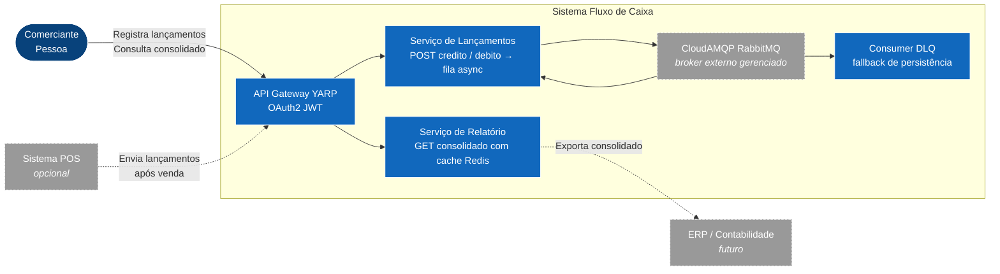

# C4 | Nível 1: Contexto do Sistema

> **Modelo C4**. Este nível mostra **o sistema visto de fora**: quem usa, com quem se integra, qual é o seu propósito de negócio.

---

## 1. Propósito

O sistema **Fluxo de Caixa** apoia no **controle financeiro diário**:
permite registrar lançamentos de **crédito** (entradas) e **débito** (saídas) e consultar o **saldo consolidado por dia**.

A arquitetura é baseada em **microsserviços** com **pipeline assíncrono via RabbitMQ** para desacoplar a escrita da leitura e garantir disponibilidade independente.

## 2. Atores

| Ator | Tipo | Interação |
|---|---|---|
| **Sistema POS** *(opcional)* | Sistema externo | Pode disparar lançamentos automaticamente após cada venda. |
| **ERP / Contabilidade** *(opcional/futuro)* | Sistema externo | Consome o consolidado para fechamento contábil. |
| **Auditoria** *(futuro)* | Pessoa/Sistema | Lê o histórico via DLQ logs ou relatório. |

## 3. Diagrama de Contexto

## 4. Limites do Sistema

| In-scope | Out-of-scope |
|---|---|
| Cadastro e armazenamento de lançamentos (créditos e débitos) por data | Conciliação bancária |
| Apresentação do **saldo consolidado diário** (pré-agregado via UPSERT) | Emissão fiscal (NF-e, SAT) |
| Validação de regras de negócio (datas, valores, descrição) | Folha de pagamento |
| Pipeline assíncrono RabbitMQ com DLQ para resiliência de escrita | Antecipação de recebíveis |
| Cache Redis com TTL inteligente para leitura escalável | Login social / cadastro de usuários |
| Exposição de API via Gateway YARP |  |

## 5. Drivers Arquiteturais

1. **Disponibilidade independente** queda do Consolidado/Relatório não pode afetar Lançamentos.
2. **Resiliência sob carga** Consolidado absorve **50 req/s** com < 5% de perda (Redis resolve).
3. **Resiliência de escrita** lançamentos nunca se perdem mesmo com queda do SQL (RabbitMQ + DLQ).
4. **Manutenibilidade** código em camadas (Clean Architecture), padrões CQRS/MediatR, testes automatizados.

## 6. Pessoas-chave de governança

| Papel | Responsabilidade |
|---|---|
| **Arquiteto Corporativo** | Decisões transversais (stack, gateway, integrações, ADRs) |
| **Arquiteto de Solução** | Mapeamento de capacidades, integração com legado |
| **Tech Lead** de cada serviço | Backlog técnico do bounded context |
| **Product Owner** | Backlog de funcionalidades (lançamentos / consolidado) |
| **SRE / DevOps** | Pipeline CI/CD, observabilidade, custos, RabbitMQ, Redis |
