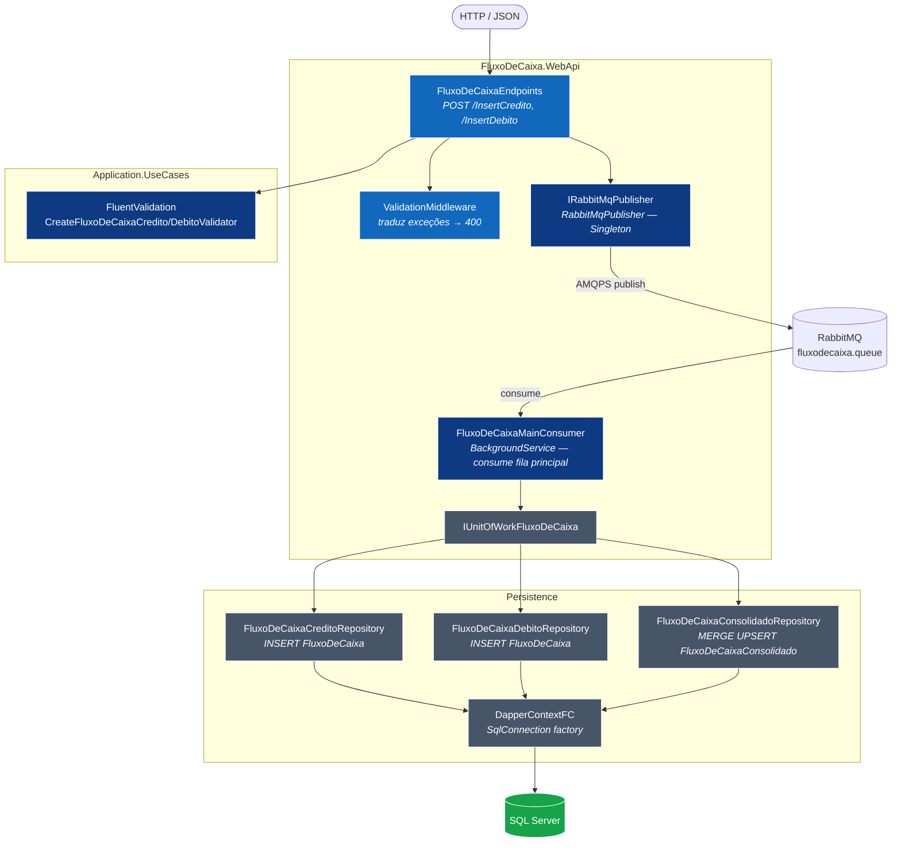
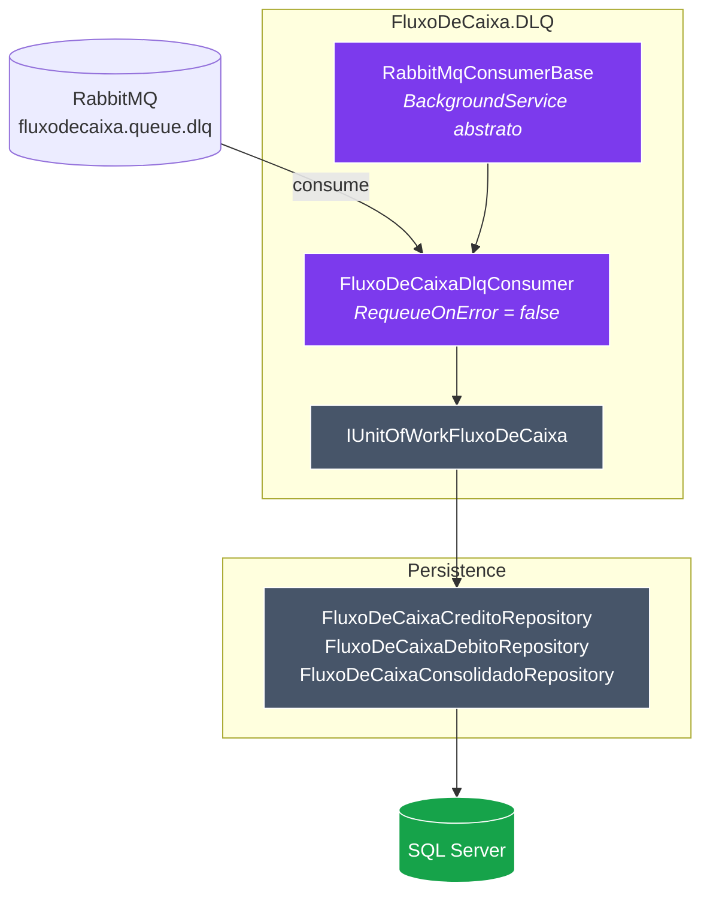
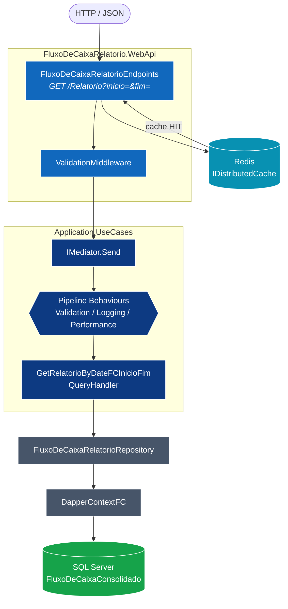
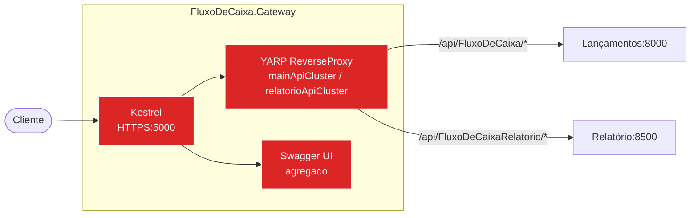
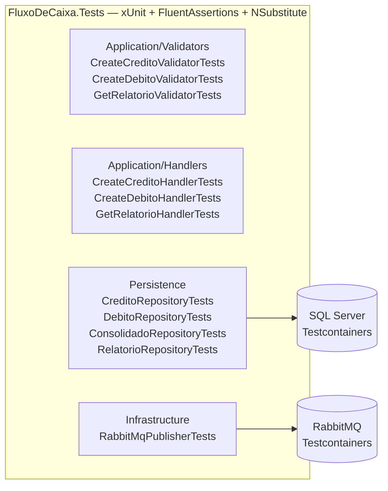

# C4 | Nível 3: Componentes

> Cada container é "aberto" para mostrar seus **componentes lógicos internos** (assemblies/módulos .NET) e como eles colaboram.

---

## 1. Componentes do **Serviço de Lançamentos** (`FluxoDeCaixa.WebApi`)

### Tabela de componentes — Lançamentos

| Componente | Camada | Responsabilidade |
|---|---|---|
| `FluxoDeCaixaEndpoints` | Apresentação | Mapeia `POST /api/FluxoDeCaixa/InsertCredito` e `/InsertDebito`. Valida inline com `IValidator<T>` e **publica `TransacaoMessage` no RabbitMQ** via `IRabbitMqPublisher`. Retorna 200 imediatamente. |
| `ValidationMiddleware` | Apresentação | Captura `ValidationExceptionCustom` e responde 400. |
| `IRabbitMqPublisher` / `RabbitMqPublisher` | Infraestrutura (Singleton) | Publica `TransacaoMessage` serializado em JSON na fila `fluxodecaixa.queue` via AMQPS. |
| `FluxoDeCaixaMainConsumer` | Infraestrutura (BackgroundService) | Consome a fila principal; decodifica `TransacaoMessage`; chama `IUnitOfWorkFluxoDeCaixa` para INSERT e UPSERT. Em caso de falha após MaxRetries → Nack → DLQ. |
| `CreateFluxoDeCaixaCreditoValidator` / `...DebitoValidator` | Aplicação | Regras FluentValidation: data 2020–2030, descrição 1–255 chars, valor ≥ 1. |
| `IUnitOfWorkFluxoDeCaixa` | Aplicação (interface) | Agrega todos os repositórios — ponto único de acesso ao Persistence. |
| `FluxoDeCaixaCreditoRepository` / `...DebitoRepository` | Infraestrutura | `INSERT INTO [dbo].[FluxoDeCaixa]` com Dapper framework ORM de alta desempenho |
| `FluxoDeCaixaConsolidadoRepository` | Infraestrutura | **`MERGE` (UPSERT)** atômico em `[dbo].[FluxoDeCaixaConsolidado]` — acumula crédito e débito por data sem race-condition. |
| `DapperContextFC` | Infraestrutura | Fábrica de `SqlConnection` (Singleton). |
| `DateOnlyTypeHandler` | Infraestrutura | Mapeia `DateOnly` ↔ `DATE` SQL Server. |

---

## 2. Componentes do **Consumer DLQ** (`FluxoDeCaixa.DLQ`)

### Tabela de componentes — DLQ

| Componente | Camada | Responsabilidade |
|---|---|---|
| `RabbitMqConsumerBase` | Infraestrutura (abstrato) | `BackgroundService` genérico; gerencia conexão AMQPS, `BasicQos`, loop de consumo, ack/nack. |
| `FluxoDeCaixaDlqConsumer` | Infraestrutura | Herda de `RabbitMqConsumerBase`; consome `fluxodecaixa.queue.dlq`; `RequeueOnError = false` — em falha apenas loga, **nunca devolve à fila** (evita loop). Persiste via `IUnitOfWorkFluxoDeCaixa`. |

---

## 3. Componentes do **Serviço de Relatório** (`FluxoDeCaixaRelatorio.WebApi`)

### Tabela de componentes — Relatório

| Componente | Camada | Responsabilidade |
|---|---|---|
| `FluxoDeCaixaRelatorioEndpoints` | Apresentação | `GET /api/FluxoDeCaixaRelatorio/Relatorio?inicio=&fim=`. Verifica Redis antes de acionar MediatR. Se cache HIT → retorna sem tocar no SQL. Se MISS → MediatR → SQL → popula cache com TTL inteligente. |
| `IDistributedCache` (Redis) | Infraestrutura | Cache-on-First-Hit; chave = `relatorio:{inicio}:{fim}`; TTL longo para datas passadas; TTL até meia-noite para período atual. |
| `GetFluxoDeCaixaRelatorioByInicioFimValidator` | Aplicação | `Inicio` obrigatório; `Fim > Inicio`. |
| `GetRelatorioByDateFCInicioFimQueryHandler` | Aplicação | Chama `FluxoDeCaixaRelatorioRepository`, monta `BaseResponse`. |
| `FluxoDeCaixaRelatorioRepository` | Infraestrutura | `SELECT * FROM FluxoDeCaixaConsolidado WHERE dataFC BETWEEN @inicio AND @fim` — range-scan no índice clustered. |

---

## 4. Componentes do **API Gateway** (`FluxoDeCaixa.Gateway`)

| Rota | Cluster | Destino |
|---|---|---|
| `/fluxodecaixa/swagger/{**catch-all}` | `mainApiCluster` | `http://lancamentos:8000` |
| `/relatorio/swagger/{**catch-all}` | `relatorioApiCluster` | `http://relatorio:8500` |
| `/api/FluxoDeCaixaRelatorio/{**catch-all}` | `relatorioApiCluster` | `http://relatorio:8500` |
| `/{**catch-all}` *(order=200)* | `mainApiCluster` | `http://lancamentos:8000` |

---

## 5. Assemblies compartilhados

| Assembly | Quem usa | O que provê |
|---|---|---|
| `FluxoDeCaixa.Domain` | Lançamentos, Relatório, DLQ | Entidades + Eventos de domínio |
| `FluxoDeCaixa.Application.Dto` | Lançamentos, Relatório | DTOs de leitura |
| `FluxoDeCaixa.Application.Interface` | Lançamentos, Relatório, DLQ | Contratos de Repositórios e UoW |
| `FluxoDeCaixa.Application.UseCases` | Lançamentos, Relatório | Commands, Queries, Handlers, Behaviours, Validators |
| `FluxoDeCaixa.Persistence` | Lançamentos, Relatório, DLQ | Implementação Dapper de Repositórios + UoW (inclui `FluxoDeCaixaConsolidadoRepository`) |
| `FluxoDeCaixa.Infrastructure` | Lançamentos, DLQ | `RabbitMqPublisher`, `RabbitMqConsumerBase`, `RabbitMqSettings`, `TransacaoMessage`, `DateOnlyTypeHandler` |

---

## 6. Suíte de Testes (`FluxoDeCaixa.Tests`)

| Grupo | Framework | Cobertura |
|---|---|---|
| Validators | xUnit + FluentAssertions | Regras de negócio (data, valor, descrição) |
| Handlers | xUnit + NSubstitute (mocks) | Fluxo de comando/query sem dependências reais |
| Repositories | xUnit + Testcontainers (SQL Server) | INSERT, UPSERT, SELECT em banco efêmero |
| RabbitMq Publisher | xUnit + Testcontainers (RabbitMQ) | Publicação e consumo end-to-end |
