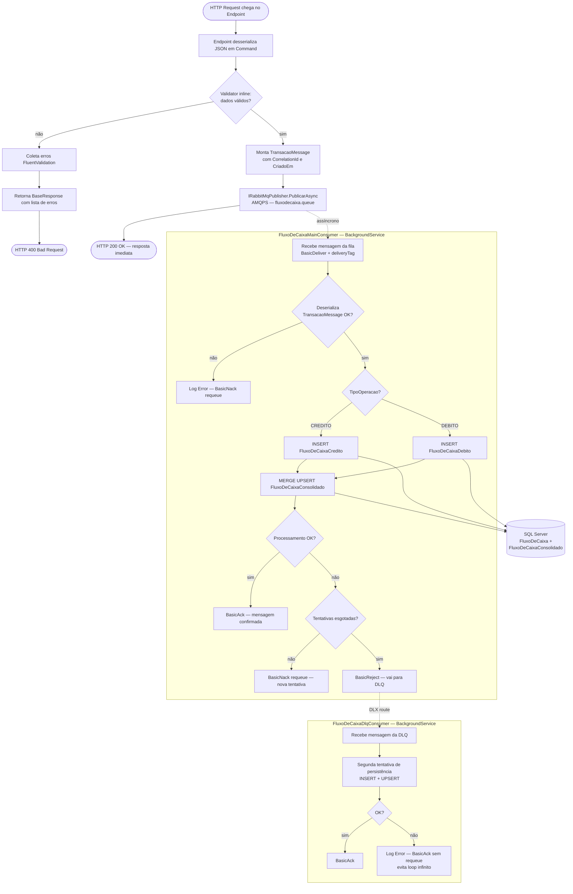
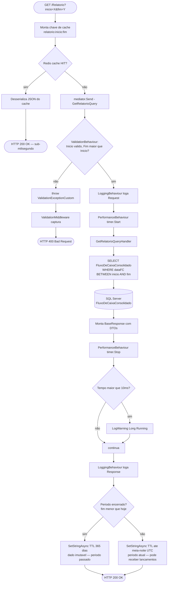

# UML | Diagrama de Atividade

> Mostra o **fluxo de execução** completo do HTTP Request até a persistência assíncrona via RabbitMQ.

---

## Fluxo de Lançamento (Crédito ou Débito)

---

## Fluxo de Consulta de Relatório (Cache Redis + SQL)

---

## Estados do pipeline | Lançamento

| Etapa | Componente | O que faz | O que falha |
|---|---|---|---|
| 1 | Endpoint | Desserializa Command, valida inline | JSON inválido → 400 do framework |
| 2 | FluentValidation | Valida regras de negócio (data, valor, descrição) | Lista de erros → 400 com BaseResponse |
| 3 | IRabbitMqPublisher | Publica TransacaoMessage no broker AMQPS | Conexão RabbitMQ falhou → 500 / retry no publisher |
| 4 | Endpoint | Retorna 200 imediatamente | — |
| 5 | FluxoDeCaixaMainConsumer | Consome fila; INSERT + UPSERT | Nack+requeue até MaxRetries → DLQ |
| 6 | FluxoDeCaixaDlqConsumer | Segunda tentativa; sem requeue | Log Error; Ack (descarta) — evita loop |

## Estados do pipeline | Relatório

| Etapa | Componente | O que faz | O que falha |
|---|---|---|---|
| 1 | Endpoint | Verifica Redis | Cache corrompido → desserialização falha → 200 com erro interno |
| 2 | Redis HIT | Retorna dado do cache | — |
| 3 | ValidationBehaviour | Valida datas da query | `ValidationExceptionCustom` → 400 |
| 4 | LoggingBehaviour | Loga payload | Nunca falha (só side-effect) |
| 5 | PerformanceBehaviour | Cronometra | Nunca falha |
| 6 | GetRelatorioQueryHandler | SELECT no consolidado | SqlException capturada → BaseResponse com mensagem de erro |
| 7 | Endpoint | Popula Redis com TTL inteligente | Redis indisponível → responde sem cachear |

> **Princípio:** cada camada faz **uma coisa**. Validar é responsabilidade do Behaviour; logar é responsabilidade do Behaviour; **handler só conhece negócio**; o endpoint só orquestra e delega.
