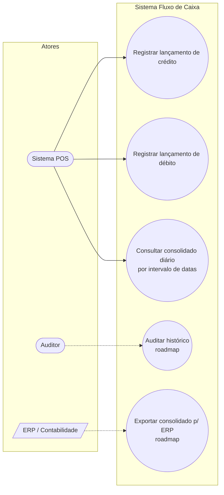

# UML | Diagrama de Casos de Uso

> Visão funcional **orientada ao usuário** quem pode fazer o quê.

## Tabela de Casos de Uso

| ID | Nome | Ator primário | Ator secundário | Pré-condições | Pós-condições |
|---|---|---|---|---|---|
| **UC-01** | Registrar lançamento de **crédito** | POS | Usuário autenticado *(roadmap)*; data ∈ [2020,2030]; valor ∈ [R$ 1, R$ 9.999.999.999,99] | Linha persistida em `FluxoDeCaixa` com novo UUIDv7 |
| **UC-02** | Registrar lançamento de **débito** | POS | idem UC-01 | idem UC-01 |
| **UC-03** | Consultar **consolidado diário** | Ator | — | `inicio` e `fim` informados; `fim > inicio` | Lista de saldos por dia devolvida |
| **UC-04** *(roadmap)* | Auditar histórico | Auditor | — | Permissão de auditoria | Lista paginada de eventos |
| **UC-05** *(roadmap)* | Exportar para ERP | ERP | Sistema (job) | Período fechado | Arquivo/feed entregue ao ERP |

---

## Cenários (UC-01 | caminho feliz)

1. O Ator envia `POST /api/FluxoDeCaixa/InsertCredito` com `{dataFC, descricao, credito}`.
2. O Gateway autentica *(roadmap)* e roteia para o serviço de Lançamentos.
3. O `ValidationBehaviour` valida o input (data, descrição, valor).
4. O handler gera **UUIDv7** como `ID`, persiste via Dapper.
5. O sistema responde **HTTP 200** com `{ succcess: true, data: true, message: "Criado com sucesso!" }`.

## Cenários alternativos (UC-01)

- **A1** — Valor > R$ 9.999.999.999,99 → `HTTP 400 { errors: [{property: "credito", error: "..."}] }`
- **A2** — Data fora de [2020-2030] → `HTTP 400`
- **A3** — Descrição vazia → `HTTP 400`
- **A4** — Falha de banco (SqlException) → `HTTP 200` com `{ succcess: false, message: "<ex.Message>" }` *(comportamento atual; recomendado evoluir para 5xx no roadmap)*

## Cenários (UC-02 | caminho feliz)

1. O Ator envia `POST /api/FluxoDeCaixa/InsertDebito` com `{dataFC, descricao, debito}`.
2. O Gateway autentica *(roadmap)* e roteia para o serviço de Lançamentos.
3. O `ValidationBehaviour` valida o input (data, descrição, valor).
4. O handler gera **UUIDv7** como `ID`, persiste via Dapper.
5. O sistema responde **HTTP 200** com `{ succcess: true, data: true, message: "Criado com sucesso!" }`.

## Cenários alternativos (UC-02)

- **A1** — Valor > R$ 9.999.999.999,99 → `HTTP 400 { errors: [{property: "debito", error: "..."}] }`
- **A2** — Data fora de [2020-2030] → `HTTP 400`
- **A3** — Descrição vazia → `HTTP 400`
- **A4** — Falha de banco (SqlException) → `HTTP 200` com `{ succcess: false, message: "<ex.Message>" }` *(comportamento atual; recomendado evoluir para 5xx no roadmap)*
