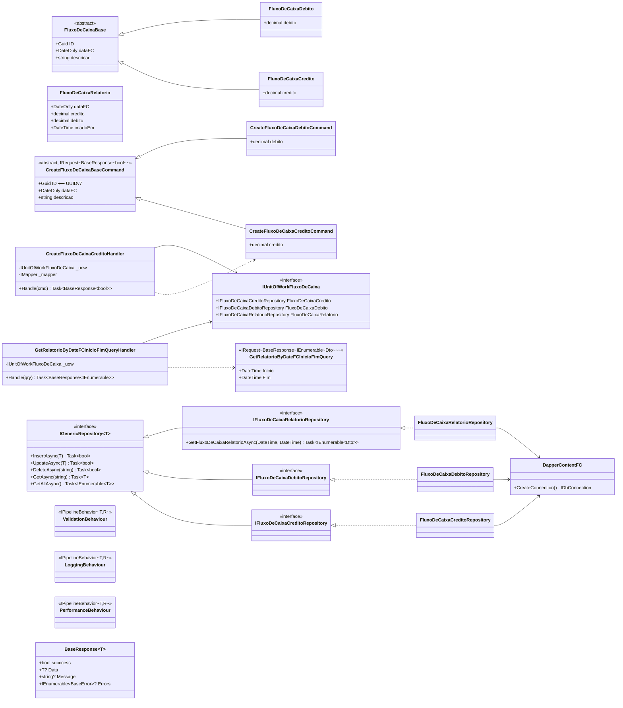

# UML | Diagrama de Classes

Representa as classes principais do **Domínio** e da **Aplicação** com seus relacionamentos.

## Pontos a destacar

- **Herança** em `FluxoDeCaixaBase` (Credito/Debito) facilita a criação de validators e mappings comuns sem duplicação.
- **Comandos espelham as entidades** mas com **`ID` gerado server-side** (UUIDv7) controle total sobre o identificador, evitando IDs maliciosos do cliente.
- **`IGenericRepository<T>`** dá CRUD básico; cada repositório especializado adiciona regras específicas (ex.: `GetFluxoDeCaixaRelatorioAsync(inicio, fim)`).
- **`IUnitOfWorkFluxoDeCaixa`** agrega os repositórios futuramente pode envelopar uma transação SQL (`BeginTransaction` / `Commit` / `Rollback`).
- **Handlers dependem só de interfaces** (UoW, IMapper) testáveis com `Moq`/`NSubstitute`.
- **`BaseResponse<T>`** é o **envelope padrão** das APIs desacopla o domínio do shape HTTP.
