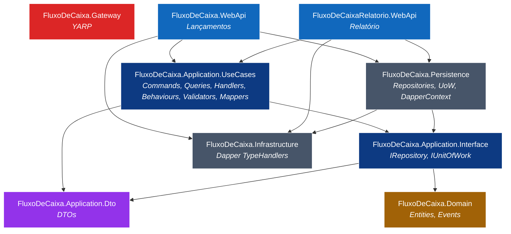

# UML — Diagrama de Componentes

> Mapa de assemblies (.dll) da solução e suas dependências de compilação.

## Pacotes externos (NuGet) usados

| Assembly | Pacotes principais |
|---|---|
| `FluxoDeCaixa.Application.UseCases` | `MediatR 14`, `AutoMapper 16`, `FluentValidation 11`, `Medo.Uuid7 3` |
| `FluxoDeCaixa.Persistence` | `Dapper 2.1`, `System.Data.SqlClient 4.8` |
| `FluxoDeCaixa.Infrastructure` | `Dapper 2.1` |
| `FluxoDeCaixa.WebApi` / `FluxoDeCaixaRelatorio.WebApi` | `Swashbuckle.AspNetCore 6.6`, `Microsoft.AspNetCore.OpenApi 8` |
| `FluxoDeCaixa.Gateway` | `Yarp.ReverseProxy 2.3`, `Swashbuckle.AspNetCore 6.6` |

## Regras de dependência (Clean Architecture)

✅ Permitido:
- `Domain` ← qualquer um (núcleo é referenciado por todos).
- `Application.UseCases` referencia `Application.Interface`, `Dto` e `Domain`.
- `Persistence` referencia `Application.Interface` e `Infrastructure`.
- `WebApi/*` referencia `Application.UseCases`, `Persistence` e `Infrastructure` (apenas para `AddInjection*`).

❌ Proibido:
- `Domain` referenciar qualquer outra camada.
- `Application.UseCases` referenciar `Persistence` ou `WebApi`.
- `Persistence` referenciar `Application.UseCases`.

> Estas regras podem ser **forçadas em build** com `NetArchTest` ou `ArchUnitNET` (recomendado adicionar no roadmap de testes).
