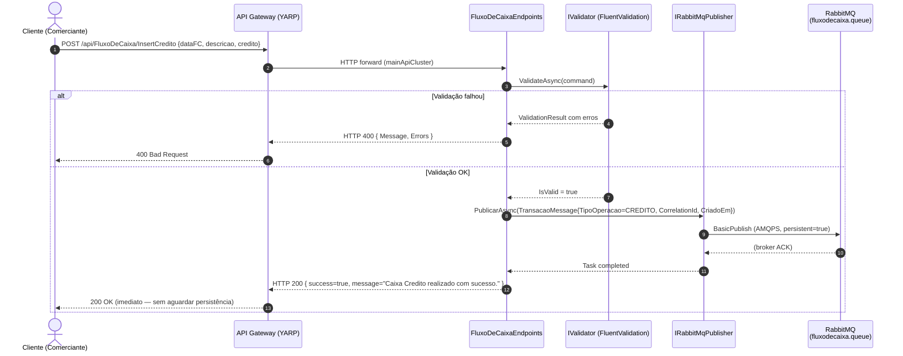
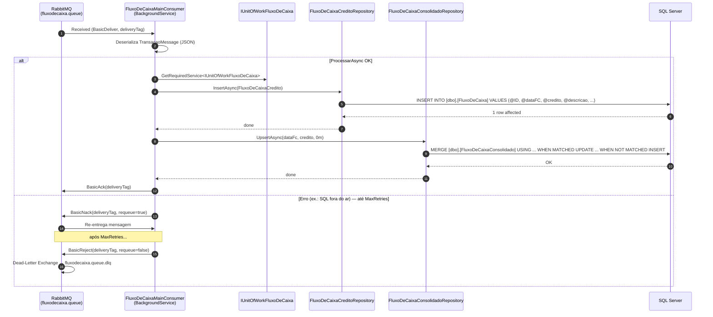
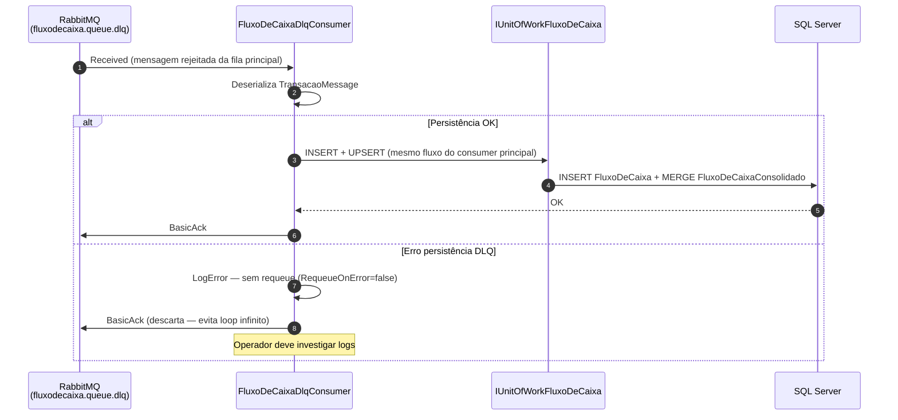

# UML — Diagrama de Sequência: Lançar Crédito (Pipeline Assíncrono RabbitMQ)

> Fluxo completo de `POST /api/FluxoDeCaixa/InsertCredito` — do Gateway à persistência final via broker.

---

## Fase 1 — Publicação (síncrona, rápida)

---

## Fase 2 — Consumo e Persistência (assíncrona, BackgroundService)

---

## Fase 3 — Dead Letter Queue (fallback, projeto FluxoDeCaixa.DLQ)

---

## Comentários de design

- **Resposta imediata ao cliente** — o comerciante recebe confirmação em milissegundos, independente do estado do banco.
- **Resiliência** — fila absorve picos de escrita; banco pode ser restaurado sem perder lançamentos.
- **DLQ como rede de segurança** — nenhum lançamento é perdido silenciosamente; há sempre uma segunda tentativa e rastro de log.
- **RequeueOnError = false no DLQ** — previne loop infinito de mensagens venenosas ("poison messages").
- **CorrelationId** em cada `TransacaoMessage` permite rastrear o ciclo de vida fim-a-fim no sistema de observabilidade.
