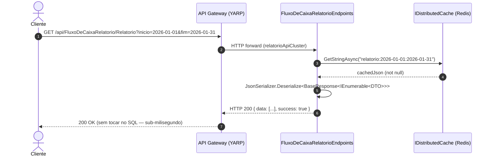
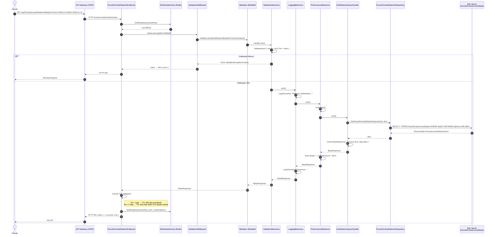
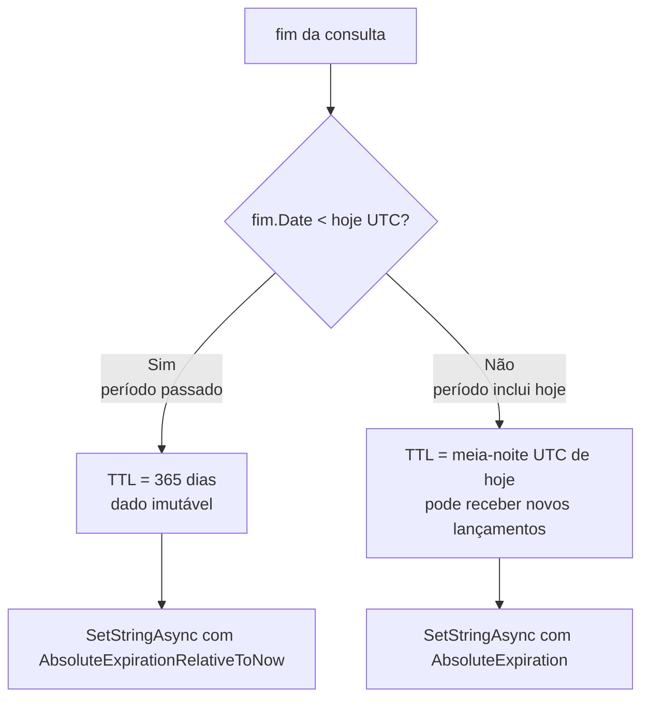

# UML — Diagrama de Sequência: Consultar Relatório Consolidado (Cache Redis + SQL)

> Fluxo de `GET /api/FluxoDeCaixaRelatorio/Relatorio?inicio=&fim=` com estratégia Cache-on-First-Hit.

---

## Caminho com Cache HIT (Redis)

---

## Caminho com Cache MISS (Redis → SQL → popula cache)

---

## TTL Inteligente — lógica de decisão

---

## Comentários de design

- **Cache HIT** não acessa MediatR nem SQL — latência ≤ 1ms (Redis em rede local).
- **>99% de hits** após warmup — aniquila o pico de 50 req/s sobre o SQL Server.
- **Chave de cache** inclui intervalo de datas → granularidade fina; consultas diferentes têm caches independentes.
- **TTL de 365 dias** para períodos fechados: dado financeiro de um dia passado não muda (sem edição de lançamentos nesta versão).
- **TTL até meia-noite** para o dia atual: novos lançamentos chegam via RabbitMQ e são consolidados via UPSERT durante o dia — o cache "expira" ao virar o dia e o próximo request popula com dados atualizados.
- O `PerformanceBehaviour` detecta queries lentas (>10ms) mesmo com Dapper — útil para monitorar degradação do SQL Server.
