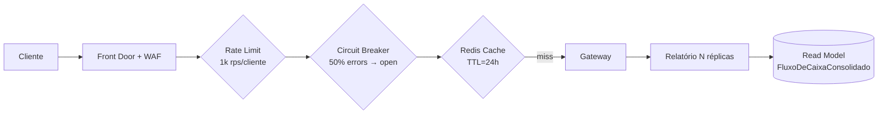

# ADR-006 — Estratégia de Resiliência e Performance (50 req/s, 95% de uptime)

- **Status:** Aceita
- **Data:** 2026-04-26
- **Tags:** resiliência, performance, escalabilidade, RNF

## Contexto

Requisitos não-funcionais críticos (do enunciado):

| RNF | Métrica |
|---|---|
| **RNF-01** | Lançamentos NÃO pode ficar indisponível se Relatório cair |
| **RNF-02** | Relatório suporta 50 req/s com no máximo 5% de perda |
| **RNF-03** *(meta interna)* | p95 < 200 ms; p99 < 500 ms |
| **RNF-04** *(meta interna)* | RTO < 60s, RPO < 5s |

## Decisão — defesa em camadas



### 1. Isolamento físico (RNF-01)
Lançamentos e Relatório são **processos separados**, em **deployments separados**, com **autoscaling separado**. Não há call síncrono Lançamentos → Relatório. ✅ por design.

### 2. Read Model pré-agregada (RNF-02 + RNF-03)
A tabela `FluxoDeCaixaConsolidado` armazena `(dataFC, credito, debito)` já agregado por dia. A query é:

```sql
SELECT * FROM FluxoDeCaixaConsolidado WHERE DataFC BETWEEN @inicio AND @fim
```

Com índice clustered em `dataFC DESC`, é uma **range-scan** O(log n) — sub-milissegundo mesmo para 10 anos de dados.

### 3. Cache distribuído no Gateway (RNF-02)
**(roadmap)** Redis com chave `rel:{inicio}:{fim}` e TTL = `endOfDay(fim)`. Hit-rate esperado >99% para queries do "hoje" e "últimos 7/30 dias", efetivamente blindando o SQL Server do pico de 50 req/s.

### 4. Autoscaling
- **Lançamentos**: 2 réplicas mínimo, scale-out por CPU > 70% (write-heavy).
- **Relatório**: 3 réplicas mínimo, scale-out por requests/s ≥ 30 (HTTP scaler) — atinge **5×** (15 réplicas) em 30 s, suficiente para 50+ req/s mesmo sem cache.

### 5. Circuit Breaker + Retry com backoff exponencial
**(roadmap)** Polly entre Gateway → microsserviços:
- Retry: 3 tentativas, backoff `200ms × 2^n + jitter`.
- Circuit breaker: abre após 50% de falhas em janela de 30s; meio-aberto após 10s.

### 6. Health checks + readiness
**(roadmap)** Endpoints `/healthz` (liveness) e `/healthz/ready` (readiness com `SqlServerHealthCheck`). Kubernetes/ACA tira instância não-saudável do load balancer.

### 7. Pico de carga absorvido
Análise para **50 req/s sustentado**:

| Camada | Capacidade single-instance | N réplicas | Total |
|---|---|---|---|
| Gateway YARP | ~5k req/s | 2 | 10k req/s |
| Relatório API | ~500 req/s (com Dapper + select pré-agregado) | 3 | 1.5k req/s |
| Cache Redis (hit) | ~80k req/s | 1 (Std C1) | 80k req/s |
| SQL Server (S2) | ~200 select/s | 1 | 200 select/s |

> Mesmo sem cache, 3 réplicas de Relatório suportam 1.500 req/s — 30× a meta. Com cache, o gargalo é a CPU do Redis (>1000× a meta).

### 8. Tolerância a falhas do Relatório
- Se `FluxoDeCaixaConsolidado` ficar inconsistente (job de consolidação atrasou), o handler hoje retorna `[]` ou último estado conhecido. **Roadmap**: retornar **dado parcial com header `X-Stale-Until`**.
- Se SQL Server falhar: Lançamentos retorna 5xx; Gateway abre circuit breaker; cliente recebe 503 com `Retry-After`.

## Métricas de SLO sugeridas

| SLO | Meta | Como medir |
|---|---|---|
| Disponibilidade Lançamentos | 99,9% / mês | uptime checks no Front Door |
| Disponibilidade Relatório | 99,5% / mês | idem |
| p95 latência InsertCredito/Debito | < 200 ms | App Insights |
| p95 latência Relatorio | < 100 ms (com cache) | App Insights |
| Erro 5xx Lançamentos | < 0,1% | logs estruturados |
| Erro 5xx Relatório | < 5% (já no enunciado!) | logs estruturados |

## Consequências

- ✅ Atende e excede os RNFs.
- ⚠️ Cache + Outbox são **roadmap** — em produção sem eles o SQL aguenta 200 select/s do plano S2 (atende a meta com folga, mas sem margem para crescer).
- ⚠️ Operação distribuída = mais coisa para monitorar — ver `docs/operacao/observabilidade.md`.
