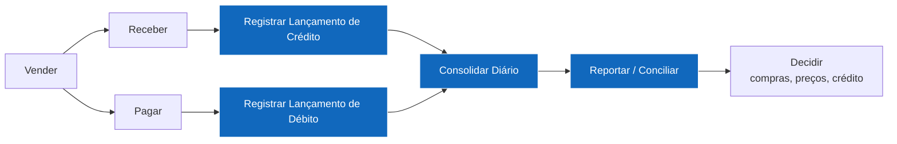
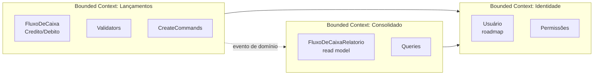
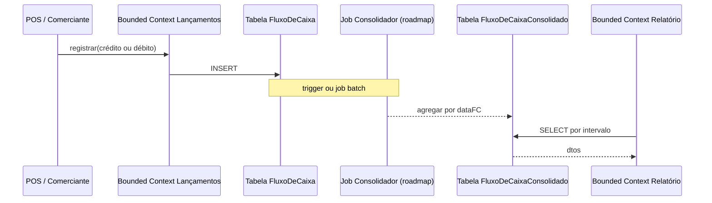

# Mapa de Domínio Funcional & Capacidades de Negócio

> Visão de **Arquiteto de Soluções**: o que o negócio faz, como decompomos em capacidades, qual a relação com bounded contexts e serviços.

---

## 1. Cadeia de Valor (visão simplificada)



A solução cobre as etapas em destaque (azul): **registrar lançamentos** (V4, V5), **consolidar** (V6) e **reportar** (V7) a cauda direta da cadeia financeira.

---

## 2. Capacidades de Negócio

| ID | Capacidade | Nível | Descrição | Cobertura nesta solução |
|---|---|---|---|---|
| **CN-01** | Gestão de Lançamentos Financeiros | L1 | Capturar, classificar, atualizar e excluir lançamentos | ✅ Captura (RF-01, RF-02); ⚠️ Update/Delete em roadmap |
| **CN-01.1** | Captura de Lançamentos | L2 | Persistir movimentações com integridade referencial | ✅ |
| **CN-01.2** | Classificação | L2 | Categorias, centro de custo, projeto | ⚠️ Hoje só `descricao` livre — roadmap |
| **CN-02** | Consolidação Financeira Diária | L1 | Agregar movimentações por janela temporal | ✅ Tabela `FluxoDeCaixaConsolidado` |
| **CN-02.1** | Consolidação Diária | L2 | Agrupamento por `dataFC` | ✅ |
| **CN-02.2** | Consolidação Multi-período | L2 | Semanal, mensal, anual | ⚠️ Possível derivar do diário |
| **CN-03** | Relatórios e Insights | L1 | Apresentar visão consolidada para decisão | ✅ Endpoint REST; ⚠️ UI/dashboards em roadmap |
| **CN-04** | Auditoria e Compliance | L1 | Registrar quem fez o quê, quando | ⚠️ Roadmap (event sourcing parcial) |
| **CN-05** | Integração com Sistemas | L1 | Trocar dados com POS, ERP, contabilidade | ✅ API REST aberta para POS; ⚠️ ERP em roadmap |
| **CN-06** | Segurança e Acesso | L1 | AuthN, AuthZ, criptografia | ⚠️ Placeholder JWT — roadmap |
| **CN-07** | Observabilidade Operacional | L1 | Saber se está funcionando, com qual qualidade | ✅ Logs/Perf via Behaviours; ⚠️ Métricas/traces em roadmap |

---

## 3. Bounded Contexts (DDD)



| Bounded Context | Time | Microsserviço | Modelo | Justificativa |
|---|---|---|---|---|
| **Lançamentos** | Squad Financeiro Operacional | `FluxoDeCaixa.WebApi` | Write model — entidades transacionais | Cada lançamento é um fato; consistência forte exigida |
| **Consolidado** | Squad Financeiro Analítico | `FluxoDeCaixaRelatorio.WebApi` | Read model — agregados | Consultas analíticas com padrão de acesso diferente |
| **Identidade** *(externo / roadmap)* | Plataforma | Azure AD / Keycloak (externo) | OIDC | Não reinventar a roda |

> Mesmo hoje compartilhando assemblies, os contextos têm **modelos distintos** (`FluxoCaixa` vs `FluxoDeCaixaRelatorio`). A separação física vem na próxima evolução.

---

## 4. Mapa de Domínio (Linguagem Ubíqua)

| Termo de negócio | Termo técnico | Onde no código |
|---|---|---|
| Lançamento | `FluxoDeCaixaBase` | `Domain/Entities/FluxoCaixa.cs` |
| Crédito | `FluxoDeCaixaCredito` | idem |
| Débito | `FluxoDeCaixaDebito` | idem |
| Data do lançamento | `dataFC` (DateOnly) | idem |
| Descrição | `descricao` (string) | idem |
| Saldo do dia | `FluxoDeCaixaRelatorio { dataFC, credito, debito }` | `Domain/Entities/FluxoDeCaixaRelatorio.cs` |
| Consolidado | `FluxoDeCaixaConsolidado` (tabela) | `Sql/Create CML.sql` |
| Identificador único do lançamento | `Guid` (UUIDv7) | `CreateFluxoDeCaixaBaseCommand` |

---

## 5. Eventos de Domínio

Já modelados como **classes** (em `FluxoDeCaixa.Domain.Events`) ainda não publicados em broker, mas pronto para o Outbox Pattern (roadmap):

```csharp
public abstract class FluxoDeCaixaCreatedBaseEvent : BaseEvent
{
    public Guid ID { get; set; }
    public DateOnly dataFC { get; set; }
    public string descricao { get; set; }
}

public abstract class FluxoDeCaixaCreatedCreditoEvent : BaseEvent {
    public decimal credito { get; set; }
}

public abstract class FluxoDeCaixaCreatedDebitoEvent : BaseEvent {
    public decimal debito { get; set; }
}
```

> `BaseEvent : INotification` (MediatR) → no fluxo síncrono atual, podem ser publicados in-process via `_mediator.Publish(...)`. No fluxo assíncrono futuro, o handler da entrega serializa em mensagem e envia ao broker.

---

## 6. Fluxo de dados macro



Hoje a "agregação" é feita por SQL manual (script em `Sql/Create CML.sql`):
```sql
INSERT INTO FluxoDeCaixaConsolidado(dataFC, credito, debito)
SELECT dataFC, SUM(credito), SUM(debito) FROM FluxoDeCaixa GROUP BY dataFC
```

**Roadmap**: substituir por **job de consolidação** (background service) ou **trigger SQL** ou (preferível) **handler de evento** publicado pelo Lançamentos (Outbox Pattern).
