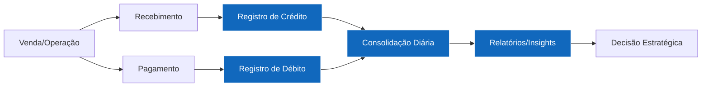
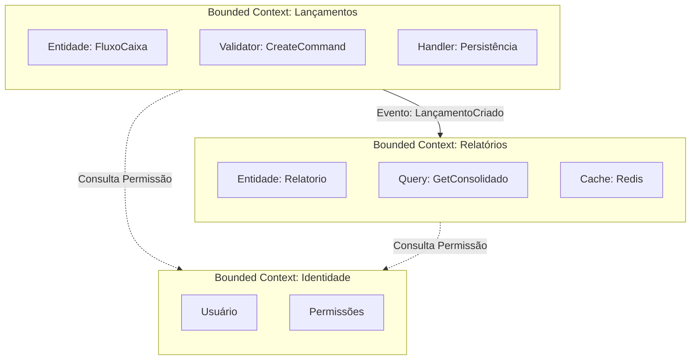
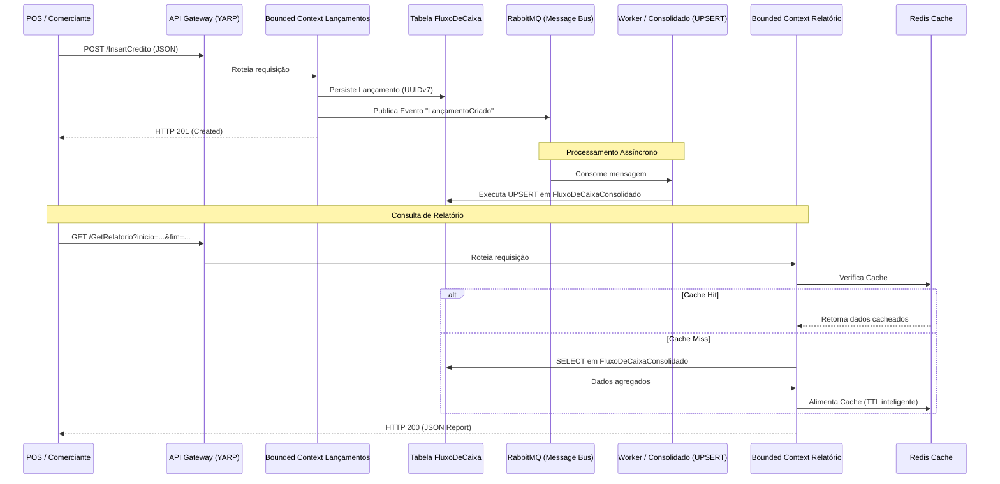

# Mapa de Domínio Funcional & Capacidades de Negócio

> Visão de **Arquiteto de Soluções Sênior**: Este documento define como o negócio de Fluxo de Caixa é decomposto em capacidades, como essas capacidades são mapeadas para o domínio técnico através de Bounded Contexts e como a linguagem ubíqua une os stakeholders técnicos e de negócio.

---

## 1. Cadeia de Valor Financeira (PMEs)

A solução de Fluxo de Caixa atua no coração da gestão financeira do comerciante, transformando transações operacionais em insights estratégicos.



A solução automatiza as etapas de **registro**, **consolidação** e **exposição de dados**, garantindo que o comerciante tenha uma visão clara de sua saúde financeira em tempo real.

---

## 2. Capacidades de Negócio (Business Capabilities)

As capacidades representam "o que" o negócio faz. Elas são estáveis e servem como base para a arquitetura de microsserviços.

| ID | Capacidade | Nível | Descrição | Cobertura Atual |
|---|---|---|---|---|
| **CN-01** | **Gestão de Transações** | L1 | Captura e manutenção de lançamentos financeiros. | **Parcial**: Registro (Crédito/Débito) implementado. Edição/Exclusão no roadmap. |
| **CN-01.1** | Registro de Lançamentos | L2 | Persistência atômica de movimentações financeiras. | **Completa**: Implementada via Microsserviço de Lançamentos. |
| **CN-01.2** | Classificação Financeira | L2 | Categorização de lançamentos para análise. | **Roadmap**: Atualmente utiliza descrição livre. |
| **CN-02** | **Consolidação Financeira** | L1 | Processamento e agregação de dados transacionais. | **Completa**: Implementada via lógica de UPSERT no banco de dados. |
| **CN-02.1** | Agregação Diária | L2 | Consolidação de saldos por data de competência. | **Completa**: Tabela `FluxoDeCaixaConsolidado`. |
| **CN-02.2** | Agregação Multi-período | L2 | Visões semanais, mensais e anuais. | **Completa**: Suportada pelo endpoint de Relatório. |
| **CN-03** | **Inteligência Financeira** | L1 | Exposição de dados consolidados para decisão. | **Completa**: Microsserviço de Relatórios com Cache Redis. |
| **CN-04** | **Conformidade e Auditoria** | L1 | Garantia de integridade e rastro das operações. | **Roadmap**: Implementação de Event Sourcing e Logs de Auditoria. |
| **CN-05** | **Interoperabilidade** | L1 | Integração com ecossistema (POS, ERP, Bancos). | **Completa**: APIs RESTful via Gateway YARP. |
| **CN-06** | **Segurança Cibernética** | L1 | Proteção de dados sensíveis e controle de acesso. | **Roadmap**: Implementação de OAuth2/JWT e WAF. |
| **CN-07** | **Resiliência Operacional** | L1 | Garantia de continuidade do negócio sob falhas. | **Completa**: Mensageria assíncrona (RabbitMQ) e DLQ. |

---

## 3. Bounded Contexts (DDD)

A decomposição técnica segue os limites de domínio identificados, garantindo baixo acoplamento e alta coesão.



| Bounded Context | Responsabilidade | Modelo | Justificativa Arquitetural |
|---|---|---|---|
| **Lançamentos** | Registro transacional e integridade de dados. | **Write Model** | Foco em consistência forte e performance de escrita. |
| **Relatórios** | Agregação e exposição de dados analíticos. | **Read Model** | Foco em performance de leitura e escalabilidade horizontal. |
| **Identidade** | Autenticação e Autorização (IAM). | **Cross-Cutting** | Centralização de segurança seguindo normativas BACEN/LGPD. |

---

## 4. Linguagem Ubíqua (Ubiquitous Language)

Dicionário compartilhado entre especialistas de negócio e desenvolvedores para evitar ambiguidades.

| Termo de Negócio | Termo Técnico | Definição |
|---|---|---|
| **Lançamento** | `FluxoDeCaixaBase` | Registro individual de uma movimentação financeira. |
| **Crédito** | `FluxoDeCaixaCredito` | Lançamento de entrada de valores no caixa. |
| **Débito** | `FluxoDeCaixaDebito` | Lançamento de saída de valores do caixa. |
| **Saldo Consolidado** | `FluxoDeCaixaConsolidado` | Resultado da soma de créditos e débitos em um período. |
| **Data de Competência** | `dataFC` | A data em que o lançamento efetivamente impacta o caixa. |
| **Identificador Único** | `ID (UUIDv7)` | Chave primária ordenável no tempo para rastreabilidade. |
| **Fila de Mensagens** | `RabbitMQ` | Canal de comunicação assíncrona para garantir resiliência. |

---

## 5. Eventos de Domínio e Fluxo de Dados

A comunicação entre contextos é orientada a eventos, permitindo a evolução independente dos serviços.

### 5.1. Eventos Implementados/Planejados
*   `FluxoDeCaixaCreatedEvent`: Disparado quando um novo lançamento é registrado.
*   `ConsolidadoUpdatedEvent` (Roadmap): Disparado quando o saldo diário é recalculado.

### 5.2. Fluxo de Dados Macro (Sequence Diagram)

O fluxo abaixo detalha a interação entre os componentes desde o registro da transação até a sua disponibilidade no relatório consolidado.



### 5.3. Mecanismo de Agregação de Dados

Atualmente, a agregação é garantida por uma lógica de **UPSERT atômico** no banco de dados, assegurando que o `read model` esteja sempre em sincronia com o `write model` após o processamento da mensagem.

**Lógica SQL de Consolidação:**
```sql
-- Exemplo conceitual da lógica de UPSERT utilizada no repositório
IF EXISTS (SELECT 1 FROM FluxoDeCaixaConsolidado WHERE dataFC = @data)
    UPDATE FluxoDeCaixaConsolidado 
    SET credito = credito + @valor_c, debito = debito + @valor_d 
    WHERE dataFC = @data
ELSE
    INSERT INTO FluxoDeCaixaConsolidado (dataFC, credito, debito) 
    VALUES (@data, @valor_c, @valor_d)
```

**Evolução (Roadmap):** Substituir a agregação direta por um **Job de Consolidação** agendado ou uma arquitetura de **Event Sourcing** completa para permitir a reconstrução do saldo a partir de qualquer ponto no tempo.

---

## 6. Evolução do Domínio (Roadmap)

1.  **Multi-Tenancy**: Suporte a múltiplos comerciantes isolados no mesmo domínio.
2.  **Categorização Inteligente**: Uso de IA para classificar descrições de lançamentos automaticamente.
3.  **Conciliação Bancária**: Integração automática com extratos via APIs de Open Banking.
4.  **Predição de Fluxo**: Algoritmos de ML para prever o saldo futuro com base no histórico.
