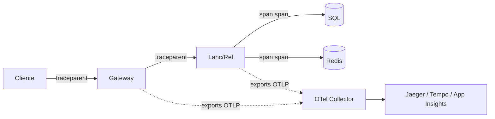

# Observabilidade

> Os 3 pilares (logs, métricas, traces) e como instrumentamos cada um.

---

## 1. Logs

### Implementado
- **`LoggingBehaviour<TRequest,TResponse>`** loga **request e response** de **todo comando/query** com `ILogger.LogInformation`.
- Formato: log estruturado JSON (semantic logging — `{@request}`).
- Níveis em uso:
  - `Information` — request/response normal.
  - `Warning` — `PerformanceBehaviour` quando >10ms.
  - `Error` — exceções não tratadas no handler.

### Exemplo (logs do `LoggingBehaviour`)
```json
{
  "ts": "2026-04-26T03:00:01.234Z",
  "level": "Information",
  "msg": "Request: CreateFluxoDeCaixaCreditoCommand",
  "request": { "ID": "...", "dataFC": "2026-04-26", "credito": 250.00 }
}
```

### Roadmap
- **Coletor centralizado**: Application Insights (Azure), Loki+Grafana (self-hosted) ou ELK.
- **CorrelationId** — middleware no Gateway adiciona `X-Correlation-Id`; propaga aos microsserviços via header; cada log carrega.
- **Mascaramento de PII** — filtrar `descricao` antes de logar em produção (LGPD).
- **Sampling** — em PRD logar 100% de erros, 10% de sucesso (reduzir custo de log).

---

## 2. Métricas

### Implementado
- **`PerformanceBehaviour<TRequest,TResponse>`** mede tempo de cada handler; `LogWarning` se > 10ms (radar de slow queries).

### Roadmap — métricas a expor (Prometheus / OpenTelemetry Metrics)

| Métrica | Tipo | Labels | SLO associado |
|---|---|---|---|
| `http_requests_total` | counter | `route`, `status`, `service` | erro 5xx < 0,1% |
| `http_request_duration_seconds` | histogram | `route`, `service` | p95 < 200 ms |
| `mediatr_handler_duration_seconds` | histogram | `request_type` | p95 handler < 50 ms |
| `sql_command_duration_seconds` | histogram | `query_name` | p95 < 30 ms |
| `dotnet_gc_*` | counter/gauge | (default) | GC pause < 50 ms |
| `process_cpu_usage` | gauge | — | < 70% sustentado |
| `redis_cache_hits_total` *(roadmap)* | counter | `key_prefix` | hit-rate > 95% |
| `circuit_breaker_state` *(roadmap)* | gauge | `cluster` | nunca em `open` |

### Como instrumentar (.NET 8 nativo)
```csharp
// Program.cs
builder.Services.AddOpenTelemetry()
  .WithMetrics(b => b
    .AddAspNetCoreInstrumentation()
    .AddHttpClientInstrumentation()
    .AddRuntimeInstrumentation()
    .AddMeter("FluxoDeCaixa.UseCases")
    .AddPrometheusExporter())
  .WithTracing(b => b
    .AddAspNetCoreInstrumentation()
    .AddHttpClientInstrumentation()
    .AddSqlClientInstrumentation()
    .AddOtlpExporter());

app.MapPrometheusScrapingEndpoint();
```

---

## 3. Traces Distribuídos

### Visão alvo



### Roadmap
- **OpenTelemetry SDK** já citado acima; basta o coletor (OTel Collector) e o backend (Jaeger / Grafana Tempo / Azure App Insights).
- **Span por handler** — adicionar `using var activity = ActivitySource.StartActivity("CreateCredito");` no `Behaviour` para granularidade fina.
- **Atributos úteis** no span: `request.id` (UUIDv7), `user.id`, `tenant.id`.

---

## 4. Health checks

### Roadmap
```csharp
builder.Services.AddHealthChecks()
    .AddSqlServer(connStr, name: "sql")
    .AddRedis(redisConnStr, name: "redis"); // quando aplicável

app.MapHealthChecks("/healthz",        new HealthCheckOptions { Predicate = _ => false });          // liveness — só responde
app.MapHealthChecks("/healthz/ready",  new HealthCheckOptions { Predicate = c => c.Tags.Contains("ready") });
```

| Endpoint | Uso pelo orquestrador |
|---|---|
| `/healthz` | Liveness — restart pod se 503 por > 30s |
| `/healthz/ready` | Readiness — tira do load balancer se 503 |

---

## 5. Alertas (SLO-based)

| Alerta | Trigger | Severidade | Ação |
|---|---|---|---|
| **Erro 5xx > 1% por 5min** | métrica `http_requests_total{status=~"5.."}` | High | Page on-call |
| **p95 latency > 500ms por 10min** | métrica `http_request_duration_seconds_bucket` | High | Page on-call |
| **SQL CPU > 80% por 15min** | Azure SQL diagnostics | Medium | Notify SRE |
| **Cache hit rate < 80%** | métrica `redis_cache_hits_total` | Medium | Notify SRE |
| **Circuit breaker open** | métrica `circuit_breaker_state` | High | Page on-call |
| **Disk SQL > 80%** | infra | Medium | Notify SRE |
| **Loop de retry em consolidação** | logs | Medium | Notify SRE |

---

## 6. Dashboards sugeridos (Grafana / App Insights Workbooks)

1. **Visão executiva** — uptime % por serviço (mês), throughput, erro %.
2. **Lançamentos detalhe** — req/s por endpoint, p50/p95/p99, top erros.
3. **Relatório detalhe** — req/s, hit-rate cache, latência por intervalo de datas.
4. **Banco de dados** — conexões ativas, locks, top queries por tempo, índice fragmentação.
5. **Infra** — CPU/RAM/rede por container/pod.

---

## 7. Runbook resumido

| Sintoma | Investigar primeiro | Remediar |
|---|---|---|
| Lançamentos lento | Logs `PerformanceBehaviour` "Long Running"; query lenta no SQL | Verificar índice; aumentar pool de conexões; scale-out |
| Relatório 5xx em pico | Saturação CPU SQL; cache hit-rate | Subir réplicas; aumentar TTL cache; downgrade temporário para `[]` |
| Gateway 502 | SSL handshake falhando; backend unreachable | `kubectl get pods` ou `az containerapp show`; restart pod |
| Inconsistência consolidado | Job de consolidação caiu | Re-rodar SQL `INSERT ... SELECT GROUP BY` (script em SETUP §2.4) |
