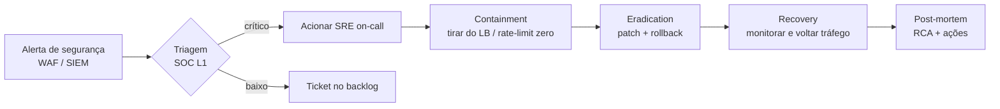

# Segurança

> Visão dos controles de segurança aplicados, planejados e responsabilidades.

---

## 1. Modelo de Ameaças (resumo STRIDE)

| Ameaça | Onde | Mitigação implementada | Mitigação roadmap |
|---|---|---|---|
| **S**poofing (identidade falsa) | Cliente → Gateway | — | JWT/OIDC validado no Gateway; mTLS interno |
| **T**ampering (alteração de dados) | Cliente → API; in-flight | TLS no Gateway; Validators rejeitam payload mal-formado | TLS 1.3 obrigatório; HSTS |
| **R**epudiation (negar ação) | Lançamentos | Logging de cada request com payload (LoggingBehaviour) | Audit log em store imutável (Append-Only) |
| **I**nformation Disclosure | Logs, BD | CORS configurado; secrets fora do código *(roadmap)* | Mascaramento de PII em logs; criptografia coluna em `descricao` |
| **D**enial of Service | Endpoints públicos | Stateless + autoscale | Rate limit no Gateway; circuit breaker; WAF Front Door |
| **E**levation of Privilege | API | — | RBAC por claim no JWT (`role: admin/editor/viewer`) |

---

## 2. Controles por Camada

### 2.1 Borda (Gateway)
- **TLS** terminado no Gateway (HTTPS:5000).
- **CORS**: configurado com `AllowAnyOrigin` em DEV (em PRD restringir).
- **Headers de segurança** *(roadmap, middleware)*:
  ```
  Strict-Transport-Security: max-age=63072000; includeSubDomains; preload
  X-Content-Type-Options: nosniff
  X-Frame-Options: DENY
  Referrer-Policy: no-referrer
  Content-Security-Policy: default-src 'none'
  ```
- **WAF** *(roadmap)*: Azure Front Door / AWS WAF protege contra OWASP Top 10.
- **Rate limit** *(roadmap)*: built-in `services.AddRateLimiter()` do .NET 8.

### 2.2 API (Microsserviços)
- **Validação de input**: 100% dos comandos têm `IValidator<T>` (FluentValidation). `ValidationBehaviour` garante que **nenhum handler executa com input inválido**.
- **Mensagens de erro**: nunca expor stack trace ao cliente — `ValidationMiddleware` retorna apenas `errors[]` semânticos.
- **Tratamento de exceções inesperadas** *(roadmap)*: middleware global que loga full stack e devolve 500 com `correlationId`.

### 2.3 Banco de Dados
- **SQL parametrizado**: 100% das queries usam `@param` (Dapper). Zero risco de SQL injection.
- **Conexão TLS**: SQL Server com `Encrypt=True;TrustServerCertificate=False` em produção.
- **Princípio do menor privilégio** *(roadmap)*: usuário SQL da aplicação tem `db_datareader` + `db_datawriter` — **não** `db_owner`.
- **TDE (Transparent Data Encryption)**: padrão em Azure SQL.

### 2.4 Secrets
- **Hoje**: `appsettings.json` (somente DEV).
- **Produção**: Azure Key Vault / AWS Secrets Manager / HashiCorp Vault.
  - Connection strings.
  - JWT signing keys.
  - Acesso via **Managed Identity** (sem credentials no container).

---

## 3. AuthN / AuthZ — Plano de evolução

### Hoje (placeholder)
`appsettings.json` define `Jwt:Issuer`, `Jwt:Secret`, `Jwt:Expires` — mas **não há `[Authorize]` nas rotas**.

### Roadmap (passo-a-passo)

1. **Configurar JWT Bearer no Gateway**:
   ```csharp
   services.AddAuthentication(JwtBearerDefaults.AuthenticationScheme)
     .AddJwtBearer(options =>
     {
         options.Authority = config["Jwt:Authority"]; // OIDC issuer
         options.Audience  = config["Jwt:Audience"];
         options.RequireHttpsMetadata = true;
     });
   ```
2. **Marcar rotas como autenticadas**:
   ```csharp
   group.MapPost("/InsertCredito", ...).RequireAuthorization();
   ```
3. **Roles via claim `role`**:
   ```csharp
   .RequireAuthorization(p => p.RequireRole("editor", "admin"));
   ```
4. **Propagar JWT do Gateway para microsserviços** via header `Authorization` (já default no YARP).
5. **Validar JWT também nos microsserviços** (defense-in-depth) com mesma `Authority`/`Audience`.

### Provedores recomendados
| Cenário | Provedor |
|---|---|
| B2B / corporativo | Azure AD / Entra |
| B2C com cadastro próprio | Azure AD B2C / Auth0 |
| Self-hosted | Keycloak / Duende IdentityServer |

---

## 4. LGPD / Privacidade

| Item | Risco | Ação |
|---|---|---|
| `descricao` pode conter PII | Alto | Mascarar em logs (`LoggingBehaviour` precisa filtro); avaliar criptografia em coluna |
| `ID UUIDv7` contém timestamp | Baixo (não é PII por si) | Ok |
| Logs com payload completo | Médio | Aplicar `LogMaskingFilter` para campos sensíveis |
| Retenção de dados | — | Definir política (sugestão: 5 anos contábeis + soft-delete) |

---

## 5. Hardening do container

```dockerfile
# Imagem oficial Microsoft .NET 8 já vem com:
# - usuário non-root 'app'
# - Distroless-like (poucos pacotes do SO)
# - Verificação de assinatura

# Adicional recomendado no Dockerfile:
USER app                          # nunca rodar como root
EXPOSE 8000                       # apenas porta necessária
HEALTHCHECK --interval=30s --timeout=3s \
  CMD curl -f http://localhost:8000/healthz || exit 1
```

---

## 6. CI/CD — Quality Gates de Segurança

| Gate | Ferramenta sugerida | Bloqueia merge? |
|---|---|---|
| **SAST** | SonarCloud / GitHub CodeQL | Sim, em vulnerabilidades High/Critical |
| **SCA** (dependências) | `dotnet list package --vulnerable` + Snyk | Sim |
| **Secret scan** | GitGuardian / TruffleHog | Sim |
| **Container image scan** | Trivy / Snyk Container | Sim, em CVE Critical |
| **DAST** *(roadmap)* | OWASP ZAP automation | Em PR para staging |

---

## 7. Resposta a incidentes (sugestão)


