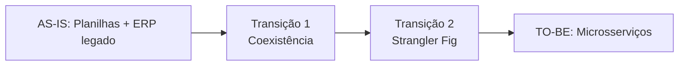
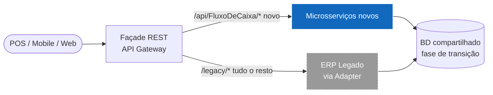
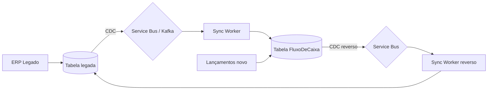

# Arquitetura de Transição

> Como migrar de um cenário **legado** (planilhas + sistema monolítico) para a **arquitetura-alvo** (microsserviços + gateway + cloud-native) sem ruptura.

---

## 1. Estados arquiteturais

### AS-IS — Estado Atual (hipotético do cliente)
- Planilhas Excel para controle diário.
- ERP monolítico legado (Delphi/.NET Framework) com fluxo de caixa parcial.
- Conciliação manual.
- Dados em silos por filial.

### TO-BE — Estado-Alvo (esta solução)
- Microsserviços (Lançamentos + Relatório) atrás de API Gateway.
- Cache distribuído + autoscale.
- Observabilidade unificada.
- Acesso via API REST a partir de qualquer cliente (POS, Mobile, Web, ERP).

---

## 2. Arquitetura de Transição (Strangler Fig)

> Padrão **Strangler Fig** (Martin Fowler) o novo sistema "estrangula" o legado gradualmente, função por função.

### Fases

| Fase | Duração | Entregas |
|---|---|---|
| **F0 — Fundação** | 4 semanas | Setup ambiente cloud, CI/CD, observabilidade, Gateway, BD compartilhado, primeira slice de **lançamento de crédito** apenas. |
| **F1 — Coexistência** | 8 semanas | Endpoint de débito; consolidação diária; integração POS via novo Gateway; ERP legado segue gerando relatórios analíticos. |
| **F2 — Strangler** | 12 semanas | Mover todas as **leituras** para o novo serviço de Relatório; ERP legado vira read-only para auditoria. |
| **F3 — Decomissionamento** | 4 semanas | Migrar dados históricos do legado; desligar tabelas legadas; manter snapshot por 5 anos para compliance. |

---

## 3. Estratégia de dados

### 3.1 Migração inicial (F0)
- **Backfill** dos lançamentos do ERP legado para a tabela `FluxoDeCaixa` via job de extração (SSIS / Azure Data Factory).
- **Conciliação automatizada**: rodar query "soma do dia no legado == soma do dia no novo" por 30 dias antes do switch.

### 3.2 Sincronização durante coexistência (F1-F2)
**Padrão Dual-Write Outbox**: o sistema legado continua escrevendo na sua tabela; **um change data capture (CDC)** captura inserts/updates e replica para `FluxoDeCaixa` (novo). O contrário também é verdadeiro até o switch.

> **Cuidado**: garantir **idempotência** (campo `external_id` para evitar laço infinito de sync).

### 3.3 Cutover (F3)
- Janela de manutenção curta (< 1 h) em horário noturno.
- Switch DNS no Gateway: 100% do tráfego para novo.
- Rollback ready: keep dual-write por mais 7 dias.

---

## 4. Estratégia de Time

### Squads
- **Squad Operação** (4-5 pessoas): owner de Lançamentos.
- **Squad Analytics** (3-4 pessoas): owner de Relatório + futuras integrações ERP/BI.
- **Squad Plataforma** (2-3 pessoas): Gateway, observabilidade, CI/CD, infra.
- **Squad Migração** (3 pessoas, temporário em F0-F3): backfill, sync, conciliação.

### Cerimônias adicionais (durante a transição)
- **Daily de migração** (15 min) alinhamento entre Plataforma + Squad Migração.
- **Reconciliation review** (semanal) revisão dos relatórios de divergência.
- **Architecture review board** (quinzenal) aprovar ADRs.

---

## 5. Riscos e mitigações

| Risco | Probabilidade | Impacto | Mitigação |
|---|---|---|---|
| Divergência entre legado e novo | Alta | Alto | Conciliação diária automatizada; alerta em diferença > 0,1% |
| Falha do CDC | Média | Alto | Outbox pattern + alertas em backlog; sync worker idempotente |
| Resistência do time legado | Média | Médio | Treinamento + pair programming durante F1 |
| Performance pior em produção | Baixa | Alto | Load test em F0 com volume real; auto-scale validado |
| Custos cloud explodirem | Média | Médio | FinOps: budget alerts, dashboard semanal, right-sizing |

---

## 6. KPIs de transição

| KPI | Meta | Onde medir |
|---|---|---|
| % do tráfego no novo Gateway | F0=10% / F1=40% / F2=80% / F3=100% | Métricas Front Door |
| Divergência diária legado × novo | < 0,1% (em valor) | Job de conciliação |
| MTTR de incidente em produção | < 30 min | App Insights + on-call |
| % de usuários treinados | 100% antes de F2 | RH/T&D |
| Cost per transaction | reduzir 30% vs AS-IS | Cost Management |
